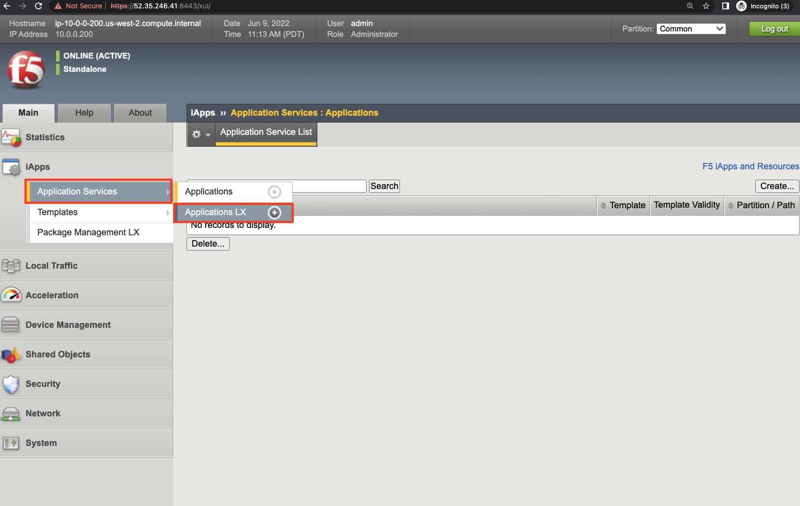
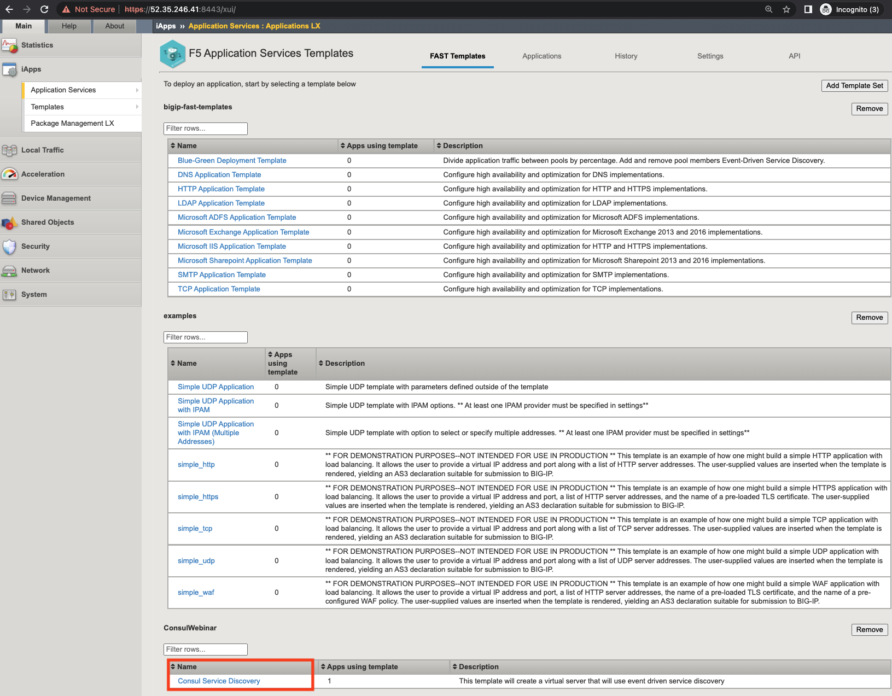
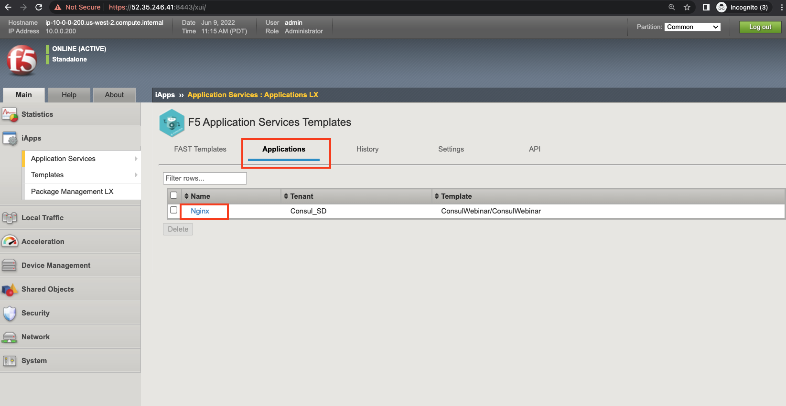

Verfiy AS3 FAST template on BIG-IP
==================================

- Once the terraform command terminates, you can verify that the FAST template deployed on your F5 instance.

- Click on **Application Services --> Application LX as shown below**

- Look for the Consul Service Discovery Template as highlighted below

- Finally go to the Application tab to locate the Nginx Application deployed in Consul_SD tenant

