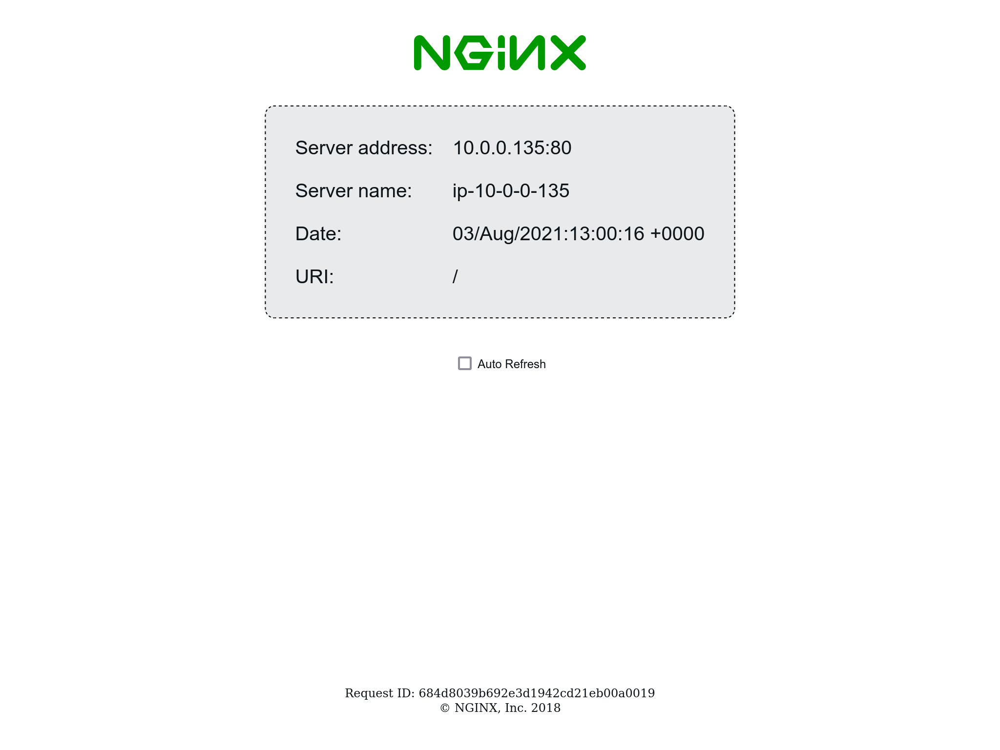

Verify Load balancing works
============================

- Open the URL provided by ``app_url`` and verify that load balancing works.
  You can go back and check the FAST template deployment exercise you did
  and check the `aap_url`  

  **Note:** To find the app_url go to the /fast direcory and execute

.. code-block:: bash

     terraform output 

**Note:** Check Mark the Auto refresh button to see all the servers