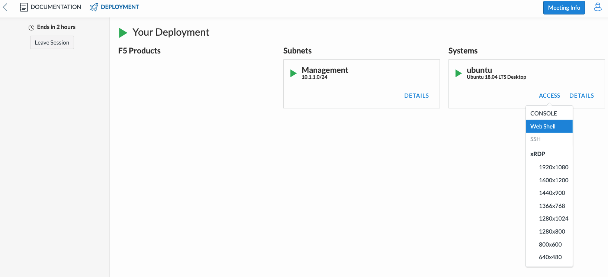
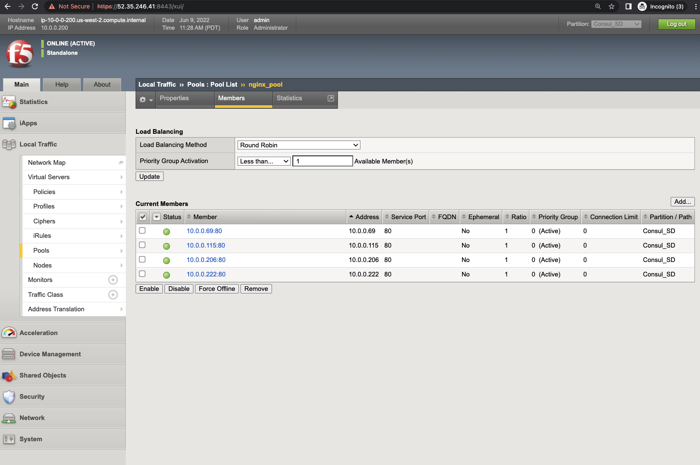
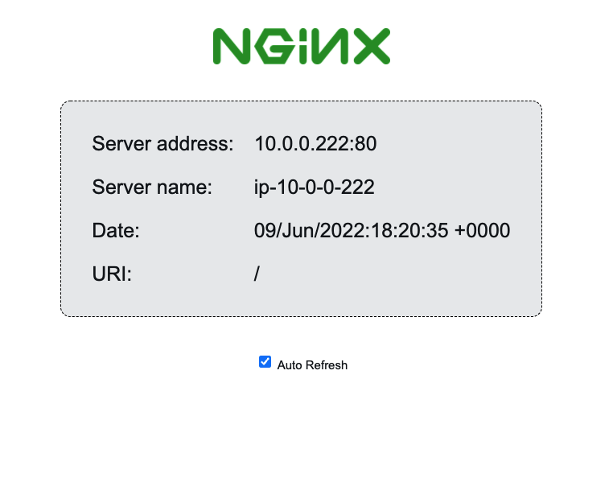

Test Automation
================

To verify the integration is working, add more NGINX instances by editing the AWS Auto Scaling group configuration.

- Open a new WebShell on the ubuntu server as shown 

- login to the server with login as ``udf`` and password as ``udf``

.. image:: ./images/8_less1-4.png
    :scale: 70%
    :alt: UDF Access

- Edit the ``nginx.tf`` file inside the terraform folder to change the desired capacity from 2 to 4.

.. code-block:: bash

   cd f5-terraform-consul-sd-webinar/terraform 
   nano nginx.tf

.. code-block:: bash 

        resource "aws_autoscaling_group" "nginx" {
            name                 = "${var.prefix}-nginx-asg"
            launch_configuration = aws_launch_configuration.nginx.name
            desired_capacity    = 4
            min_size             = 1
            max_size             = 4
            vpc_zone_identifier  = [module.vpc.public_subnets[0]]

            lifecycle {
            create_before_destroy = true
                    }

            tags = [
            {
                key                 = "Name"
                value               = "${var.prefix}-nginx"
                propagate_at_launch = true
            },
                {
                    key                 = "Env"
                    value               = "consul"
                    propagate_at_launch = true
            },
         ]

        }
    ...

- Then, use ``terraform plan`` to check the resources that are going to be changed.

.. code-block:: bash

    terraform plan

.. code-block:: bash

    Refreshing Terraform state in-memory prior to plan...
    The refreshed state will be used to calculate this plan, but will not be
    persisted to local or remote state storage.

    ...

    An execution plan has been generated and is shown below.
    Resource actions are indicated with the following symbols:
    ~ update in-place

    Terraform will perform the following actions:

    # aws_autoscaling_group.nginx will be updated in-place
    ~ resource "aws_autoscaling_group" "nginx" {

        ...

        ~ desired_capacity          = 2 -> 4

        ...

        }

    Plan: 0 to add, 1 to change, 0 to destroy.
    ...    

- Finally, apply the changes.

.. code-block:: bash

    terraform apply -auto-approve

.. code-block:: bash
    
    ...
    Apply complete! Resources: 0 added, 1 changed, 0 destroyed.
    ...

- Once the changes are applied on AWS, Consul will show the new instances on the Services tab.

 .. image:: ./images/consul-service.png
    :scale: 50%
    :alt: UDF Access
   
- Consul-Terraform-Sync will pick the change from the Consul catalog and modify the BIG-IP configuration to reflect the new NGINX instances.

.. code-block:: bash

    ...
    [INFO] (ctrl) executing task AS3
    [INFO] running Terraform command: ./f5-terraform-consul-sd-webinar/nia/terraform apply -no-color -auto-approve -input=false -var-file=terraform.tfvars -var-file=providers.tfvars -lock=true -parallelism=10 -refresh=true
    Acquiring state lock. This may take a few moments...
    module.AS3.bigip_event_service_discovery.event_pools["nginx"]: Refreshing state... [id=~Consul_SD~Nginx~nginx_pool]
    module.AS3.bigip_event_service_discovery.event_pools["nginx"]: Modifying... [id=~Consul_SD~Nginx~nginx_pool]
    module.AS3.bigip_event_service_discovery.event_pools["nginx"]: Modifications complete after 1s [id=~Consul_SD~Nginx~nginx_pool]

    Apply complete! Resources: 0 added, 1 changed, 0 destroyed.
    Releasing state lock. This may take a few moments...
    [INFO] (ctrl) task completed AS3
    [INFO] (ctrl) executing task AS3
    [INFO] running Terraform command: ./f5-terraform-consul-sd-webinar/nia/terraform apply -no-color -auto-approve -input=false -var-file=terraform.tfvars -var-file=providers.tfvars -lock=true -parallelism=10 -refresh=true
    Acquiring state lock. This may take a few moments...
    module.AS3.bigip_event_service_discovery.event_pools["nginx"]: Refreshing state... [id=~Consul_SD~Nginx~nginx_pool]
    module.AS3.bigip_event_service_discovery.event_pools["nginx"]: Modifying... [id=~Consul_SD~Nginx~nginx_pool]
    module.AS3.bigip_event_service_discovery.event_pools["nginx"]: Modifications complete after 0s [id=~Consul_SD~Nginx~nginx_pool]

    Apply complete! Resources: 0 added, 1 changed, 0 destroyed.
    Releasing state lock. This may take a few moments...
    [INFO] (ctrl) task completed AS3
    [INFO] (ctrl) executing task AS3
    [INFO] running Terraform command: ./f5-terraform-consul-sd-webinar/nia/terraform apply -no-color -auto-approve -input=false -var-file=terraform.tfvars -var-file=providers.tfvars -lock=true -parallelism=10 -refresh=true
    Acquiring state lock. This may take a few moments...
    module.AS3.bigip_event_service_discovery.event_pools["nginx"]: Refreshing state... [id=~Consul_SD~Nginx~nginx_pool]
    module.AS3.bigip_event_service_discovery.event_pools["nginx"]: Modifying... [id=~Consul_SD~Nginx~nginx_pool]
    module.AS3.bigip_event_service_discovery.event_pools["nginx"]: Modifications complete after 1s [id=~Consul_SD~Nginx~nginx_pool]

    Apply complete! Resources: 0 added, 1 changed, 0 destroyed.
    Releasing state lock. This may take a few moments...
    [INFO] (ctrl) task completed AS3
    [INFO] (ctrl) executing task AS3
    [INFO] running Terraform command: ./f5-terraform-consul-sd-webinar/nia/terraform apply -no-color -auto-approve -input=false -var-file=terraform.tfvars -var-file=providers.tfvars -lock=true -parallelism=10 -refresh=true
    Acquiring state lock. This may take a few moments...
    module.AS3.bigip_event_service_discovery.event_pools["nginx"]: Refreshing state... [id=~Consul_SD~Nginx~nginx_pool]
    module.AS3.bigip_event_service_discovery.event_pools["nginx"]: Modifying... [id=~Consul_SD~Nginx~nginx_pool]
    module.AS3.bigip_event_service_discovery.event_pools["nginx"]: Modifications complete after 0s [id=~Consul_SD~Nginx~nginx_pool]

    Apply complete! Resources: 0 added, 1 changed, 0 destroyed.
    Releasing state lock. This may take a few moments...
    [INFO] (ctrl) task completed AS3
    ...

- Login to BIG-IP and go to Virtual Server tab ---> Pool and check the new members added 

**Note:Make sure the Partition selected is ``Consul_SD``**

- Refresh the page to verify the traffic is being balanced across the four NGINX instances.

**Note:** Check Mark the Auto refresh button to see all the servers
