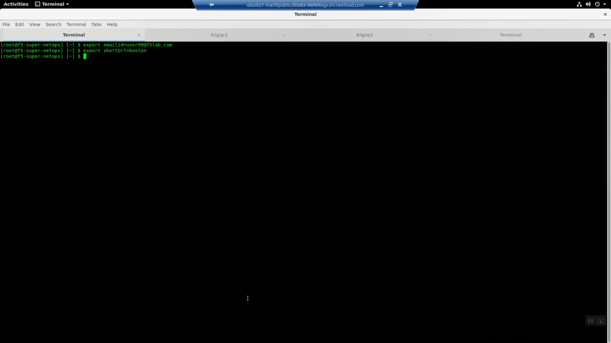
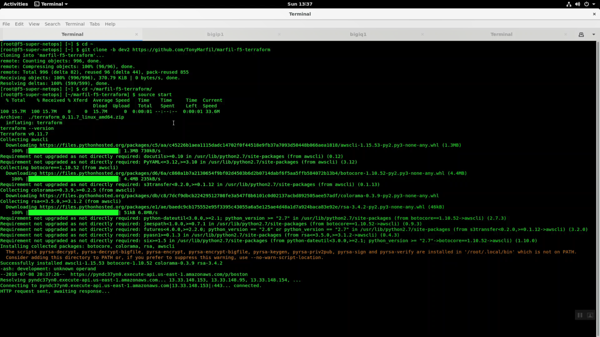
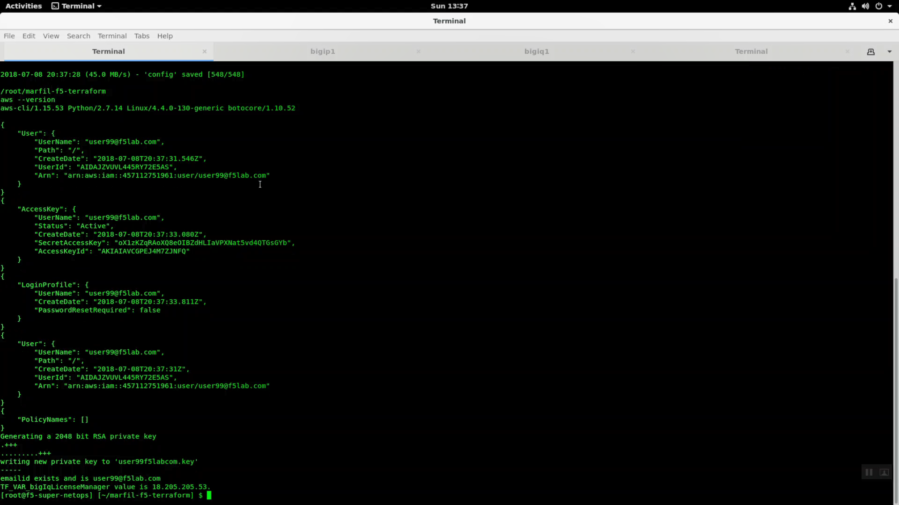

Connecting to the Lab
----------------------

.. important:: Your student account, and short URL path will be announced at the start of the lab.

- The lab environment consists of both a simulated "on-premises" datacenter hosted in Ravello and a public cloud environment hosted in AWS.
- Though the public cloud environment runs on a shared AWS account, every student will build and work in a dedicated AWS VPC.
- For this lab, a Linux Remote Desktop jump host will be provided as a consistent starting point.
- A convenient way to work through the lab is to split your screen in half: one side for the lab environment, the other side for the lab guide.

Lab Variables
-------------

The lab will make use of unique variables to provide access and isolate student environments.

============== ===========================================================
Variable Name   Variable Value
============== ===========================================================
 shortUrl       Unique Key that provides access to this lab (i.e. abc123)
 emailid        Account name for each student (i.e. user01@f5lab.com)
============== ===========================================================

Launch Remote Desktop Session to Linux
--------------------------------------

.. image:: ./images/1_ravello_portal1.png
  :scale: 50%

- Look for ubuntu1. Note the username / password. Click on *rdp* link. Download the rdp file. Click on the rdp file to launch a Remote Desktop Session to your client.

- Alternatively, you can copy and paste the ubuntu1 IP address into your Remote Desktop client to modify settings.
  
  - On Windows: Local Resources => Keyboard => Apply Windows key combinations: On the remote computer. This will allow you to quickly toggle (ALT + TAB) between windows inside the Remote Desktop Session.

- Login with username / password

.. image:: ./images/2_rdp_logon.png
  :scale: 50%

SSH to the F5-Super-NetOps Docker container
-------------------------------------------

From the Linux desktop, click on the upper-left-hand corner "Activities" to reveal the application Dock.

Click to launch the terminal application.

.. image:: ./images/3_terminal.png
  :scale: 50%

From the terminal, invoke the 'snops' command alias to ssh to the f5-super-netops docker container. Substitute user (su) to root.

.. code-block:: bash

   snops
   default
   su -
   default

.. image:: ./images/4_snops_login.png
  :scale: 50%

Set Variables
--------------

Export your student account and short URL path variables.

Your student account will be used to create an AWS console login and provide unique names for infrastructure that you create in the shared AWS account.

The short URL path will be used to grant access to the shared AWS account both via the AWS API and as the password for the AWS web console. Replace the emailid and shortUrl values below with the student account name and short URL assigned to you at the start of the lab.

Copy and paste the commands below to accomplish the steps above.

.. attention::

   **REPLACE THE EXAMPLE VALUES WITH THE VALUES PROVIDED TO YOU BY YOUR INSTRUCTOR.**

.. code-block:: bash

   export emailid=user99@f5lab.com
   export shortUrl=abc123
   printenv

The ``printenv`` command will echo all your environment variables.  Look for emailid and shortUrl. Confirm the exported variables are correct.

Initialize your Lab Environment
-------------------------------

This will create AWS credentials that you will use to access the shared AWS account.

You will:

- Change to your home directory.
- Clone the git repository for this lab.
- Change to the working directory.
- Run the start script.

Copy and paste the commands below to accomplish the steps above.

.. code-block:: bash

   cd ~
   git clone -b dev2 https://github.com/TonyMarfil/marfil-f5-terraform
   cd ~/marfil-f5-terraform/
   source start

Git clone completes successfully.

.. attention::

  For a smooth ride, always invoke commands from inside the cloned git repository (marfil-f5-terraform). To check you're in the right place you can run the command ``pwd`` and the output should read ``/root/marfil-f5-terraform``

Launch Terraform
-----------------

Now that we have created credentials to access the AWS account, we will use Terraform to deploy our lab environment.

Initialize terraform.

.. code-block:: bash

   terraform init

Invoke terraform plan. This will output the changes that terraform will apply.

.. code-block:: bash

   terraform plan

Terraform apply.

.. code-block:: bash

   terraform apply

.. image:: ./images/7_terraform_apply.png
  :scale: 50%

.. image:: ./images/8_terraform_apply_complete.png
  :scale: 50%

F5 AWS Lab Test application
---------------------------

Note the alb_dns_name value in terraform output. HTTPS to this site from any browser to see the example lab application.

.. image:: ./images/9_alb_demo_site.png
  :scale: 50%

What just happened?
-------------------

This is the TL;DR version of the steps completed.

When you clone the git repository, you are pulling down a current version of the files you need to get started. These files are hosted on Github, the most popular online revision control repository, and include:

- Onboarding scripts that create your AWS account and other prerequisites: *f5-super-netops-install.sh*, *addUser.sh*, *export.sh*.

- Terraform configuration files--a declarative, comprehensive representation of our entire application stack:

  - *main.tf* - Every terraform configuration has a main.tf. This contains all of the AWS specific (non-F5) environment configuration, including web instances
  - *f5-cloudformation*.tf files - A terraform file that takes the officially supported CloudFormation template hosted at: https://s3.amazonaws.com/f5-cft/f5-existing-stack-bigiq-1nic-bigip.templat and stuffs all of the prerequisite parameters so we don't have to do it manually.
  - *outputs.tf* - Any variable in the outputs.tf file can be rendered to the console with 'terraform output' and is exposed to other command line tools.
  - *vars.tf* - Variables for terraform.

- Handy utilities to help move the lab along with minimum fuss: *password-reset*.

The start script takes care of all of the prerequisites to standing up an AWS environment. Precisely:

- Installs all of the necessary software, including: terraform, the aws cli, and various other command line tools.
- Creates your AWS console login and api account and stores the keys locally for use by the AWS command line.
- Creates SSH keys for use by all of your EC2 instances: web servers and Big-IP virtual editions.
- Creates a self-signed SSL certificate for use in deploying https services.
- Sets the default region: us-east-1 (Virginia), ap-southeast-1 (Singapore), etc.

The terraform files go into effect when you invoke 'terraform apply'. This step makes use of all of the prerequisites from the step before to build the environment in AWS.