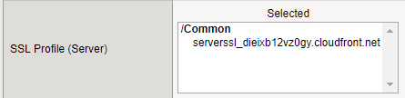

Create Virtual Server
---------------------

1.  Go to “Local Traffic > Virtual Servers > Virtual Server List” and
    click Create

2.  Name: vs\_careX-secureapigw.acmelatamlab.f5.com

3.  Destination Address/Mask: 10.1.10.201

4.  Service Port: 443
    
    |image18|

5.  HTTP Profile: http

6.  SSL Profile (Client): careX-secureapigw.acmelatamlab.f5.com
    
    |image19|

7.  SSL Profile (Server):
    
    serverssl\_YOUR\-CLOUDFRONT\-TARGET\-DOMAIN.

    E.g.: serverssl\_dieixb12vz0gy.cloudfront.net
    
    |image20|

8.  Source Address Translation: Auto Map

9.  Default Pool: pool\_secureapigw

10. Click Finished

You may ask how this Virtual Server is exposed to internet. In this lab
(based in Ravello), every time we start we get a Public IP Address that
has a NAT to 10.1.10.201. In real world that will be an Elastic IP (EIP)
from AWS.

.. |image18| image:: image18.png
.. |image19| image:: image19.png

