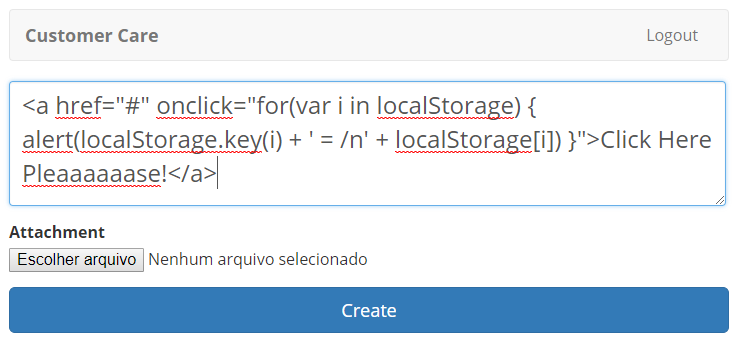

Cross-Site Scripting (XSS)
--------------------------

We’ll now check for a XSS vulnerability present in our code.

1. Click “Send your Feedback”

2. Open the File XSS.txt that is in your Desktop on the Windows Jump
   Host. Paste the attack in the form.

   .. code-block:: html

      <a href="#" onclick="for(var i in localStorage) { alert(localStorage.key(i) + ' = /n' + localStorage[i]) }">Click Here Pleaaaaaase!</a>

   |image24|

3. Review the attack code. What we are doing here is creating a link
   that execute a javascript to list all contents of the browser’s
   local storage when it is clicked.
   Click Create

4. The attack failed on the feedback list page.
   
   |image25|
   
   Why? Because the framework we are using (REACT) already removes
   script tags like “<” with “&lt;” in the source code when presenting
   the data.
   
   HTML Source Code:

   .. code-block:: html

      &lt;a href="#" onclick="for(var i in localStorage) {
      alert(localStorage.key(i) + ' = /n' + localStorage[i]) }"&gt;Click
      Here Pleaaaaaase!&lt;/a&gt;
   
   The problem is that any bug or vulnerability in the framework, like
   already happened a few times before, will expose the XSS. Like we
   use to so in the DC, we need to keep our code updated.
   Another problem is that people make mistakes. In our code this is
   what happened and we’ll see why in the next step.
   The last problem we’ll list is that on DynamoDB, our NOSQL database
   from AWS, store all the codes without encoding. The XSS is there!
   
   |image26|

   What will happen if another system that is not based on React
   Framework try to use this information? You get the idea.

5. Now click the feedback you just created.

6. Here you can edit your feedback. But it shows the original feedback
   to the user. Look what happened. The XSS is successfully executed.
   Click on ”Click Here Pleaaaaaase”
   
   |image27|

7. You should see a lot of information present on your local storage.
   
   |image28|

8. The important thing here is that not only XSS can be executed but
   other attacks like CSRF (Cross-Site Request Forgery) as well.

9. Click “Back to your Feedbacks”

   |image29|

.. |image25| image:: image25.png
.. |image26| image:: image26.png
.. |image27| image:: image27.png
.. |image28| image:: image28.png
.. |image29| image:: image29.png
