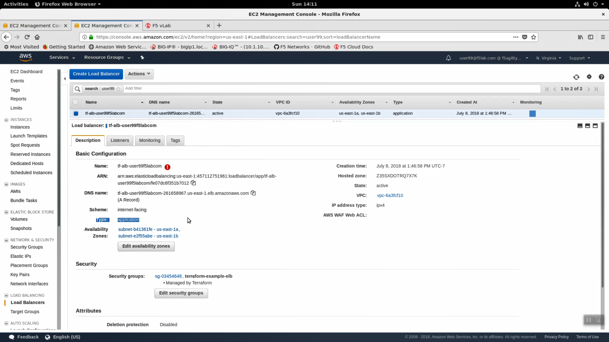
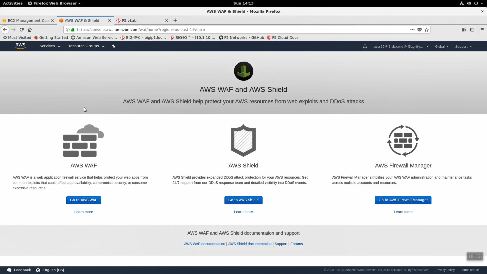
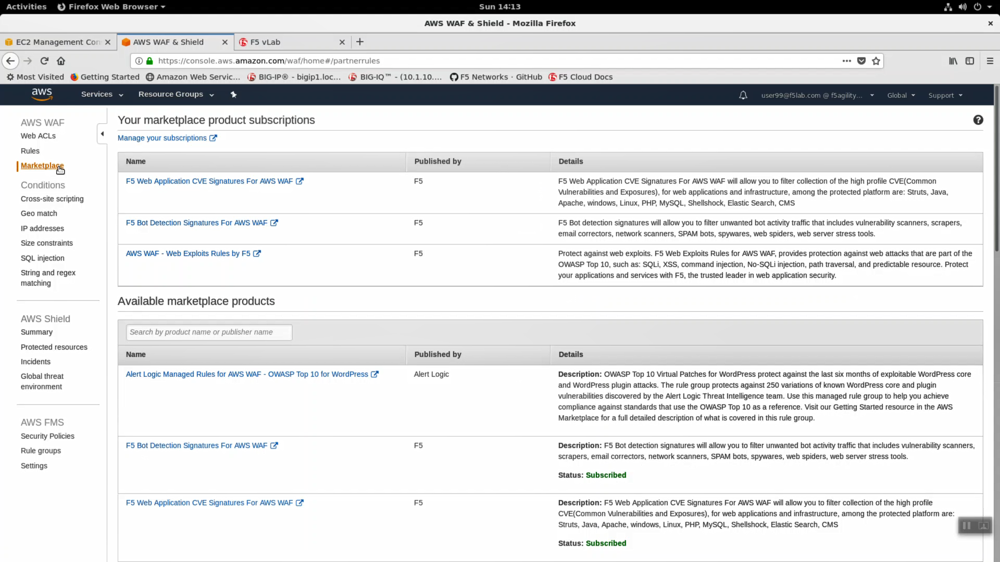
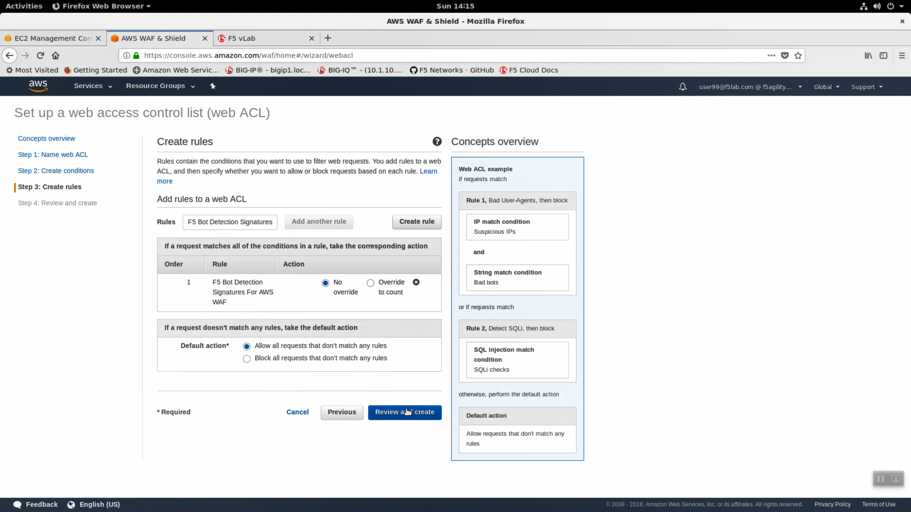
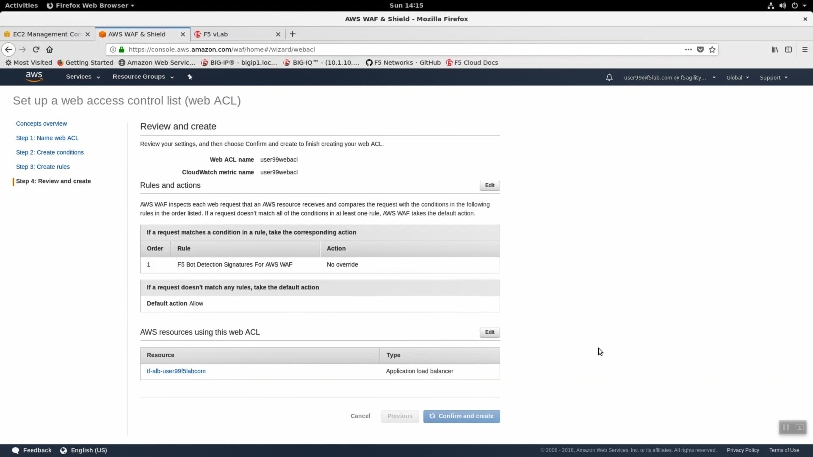
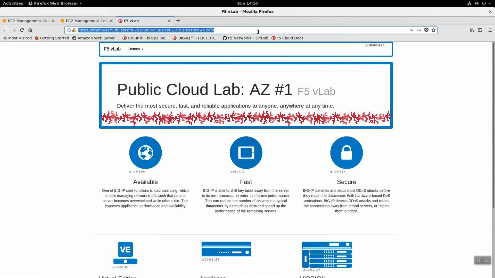

Apply F5 Networks WAF Rules to an AWS Application Load Balancer
---------------------------------------------------------------

1. From the AWS Console, navigate to Services => Compute => EC2 => LOAD BALANCING => Load Balancers. In the search filter enter your username. You should see two load balancers. One named tf-alb-\* is your newly created AWS application load balancer. Highlight the 'Description' tab. Note Scheme: internet-facing, Type: application and the AWS WAF Web ACL: has no web acl applied. Preconfigured Web-ACLs are offered by F5, offer protection against common OWASP top 10 style attacks, and can be deployed on any ALB. Functionality is a small subset of market-leading F5 WAF running on a Big-IP VE.

2. Highlight the Listeners tab. A listener is ready to receive traffic on HTTPS: 443. A TLS Certificate was installed as part of our deployment and the ALB is terminating TLS. An AWS application load balancer terminating TLS is a prerequisite for deploying WAF rules.

.. image:: ./images/2_alb_listener_https_443.png
  :scale: 50%

3. From the AWS Console, navigate to Services => Security, Identity & Compliance => WAF & Shield. Click the Go to AWS WAF button.

4. Prior to deploying F5 WAF Rules for AWS, you need to subscribe to the service and agree to the AWS subscription agreement. This has been done for you already. F5 offers three collections of WAF rules:

- F5 Web Application CVE Signatures For AWS WAF
- F5 Bot Detection Signatures For AWS WAF
- AWS WAF - Web Exploits Rules by F5

In the left hand navigation pane, click on Marketplace. Read through the Details for a summary of the protection included in each category.

5. In the left hand navigation pane, click on "Web ACLs" => "Create web ACL".

6. Fill in the "Name web ACL" fields. The example screenshot is for user99. Carefully fill in the fields with your unique user details.

+------------------------------------------+-------------------------------------------------------------------+
| Parameter                                | value                                                             |
+==========================================+===================================================================+
| Web ACL name*                            | userXXwebacl (i.e user99webacl)                                   |
+------------------------------------------+-------------------------------------------------------------------+
| CloudWatch metric name*                  | userXXwebacl (i.e user99webacl)                                   |
+------------------------------------------+-------------------------------------------------------------------+
| Region*                                  | us-east-1                                                         |
+------------------------------------------+-------------------------------------------------------------------+
| AWS resource to associate                | select your existing alb from the dropdown: tf-alb-userXXf5labcom |
+------------------------------------------+-------------------------------------------------------------------+

...click Next.

.. image:: ./images/5_name_web_acl.png
  :scale: 50%

7. Accept all defaults in Step 2: and click Next.

8. Step 3: Select F5 Bot Detection Signatures, Default action "Allow all requests...', click on "Review and create".

9. Step 4: Assign your alb resource to use this web acl. Click "Confirm and create".

10. From the AWS Console, navigate to Services => Compute => EC2 => LOAD BALANCING => Load Balancers. Highlight your alb. Confirm the AWS WAF Web ACL: shows your web acl applied.

11. Click the copy icon next to the DNS name.

.. image:: ./images/8_web_acl_applied.png
  :scale: 50%

12. Connect from a browser via https to the dns name copied and confirm your application is still up but now protected against Bot Attacks.

