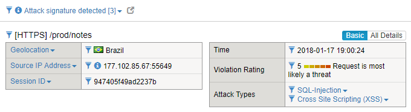

Checking Signatures Protection
------------------------------

1. Click “Send your Feedback”

2. Open developer tools by right clicking anywhere in the webpage, then
   select Inspect

3. Select the Network tab

4. Open the File XSS.txt that is in your Desktop on the Windows Jump
   Host. Paste the attack in the form. Click Create.

   .. code-block:: html
      
      <a href="#" onclick="for(var i in localStorage) { alert(localStorage.key(i) + ' = /n' + localStorage[i]) }">Click Here Pleaaaaaase!</a>

5. You should ‘ve received a pop-up error to fetch. That is because
   the request was blocked.
   
   |image45|

6. Click on the last “note” entry on developer tools. You should see
   the request payload with the content you submitted.
   
   |image46|

7. Click the “Response” tab on the right. You will see ASM Block Page
   encoded in JSON:
   
   |image47|

8. Go to “Security > Event Logs > Application > Requests”

9. Select the Blocked request. Look how nice it is to test using the
   Cloud. You can see that ASM shows the Country the request came
   from:
   
   |image48|

10. Verify why ASM blocked this request.

    |image49|

11. Click “Attack signature detected” to see the signatures matching the
    content you sent.

.. |image45| image:: image45.png
.. |image46| image:: image46.png
.. |image47| image:: image47.png
.. |image48| image:: image48.png

