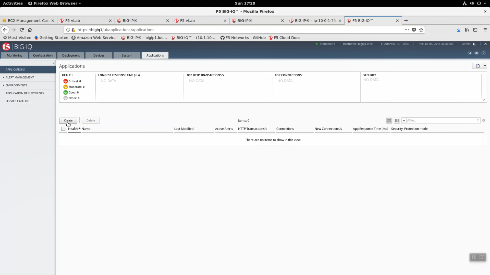
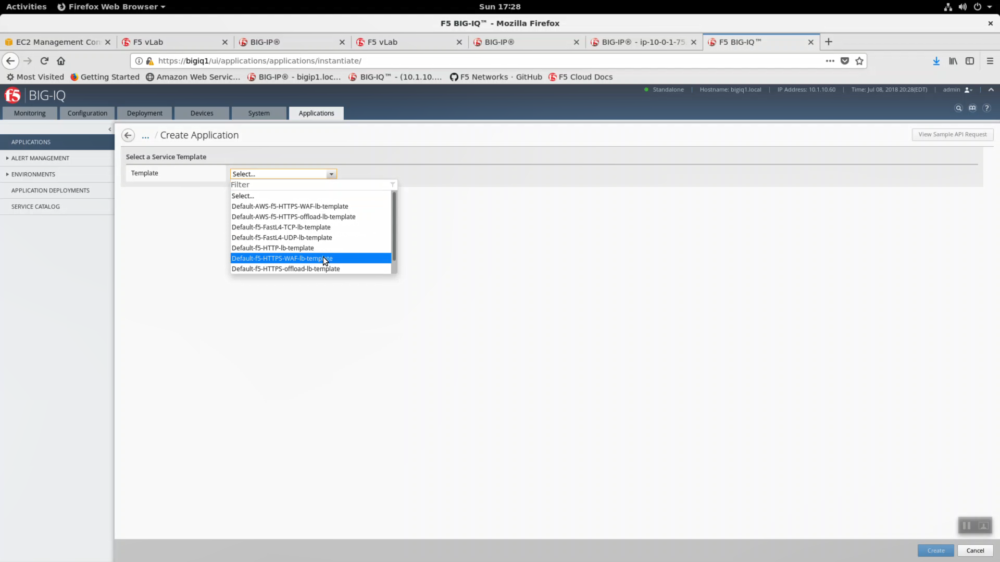
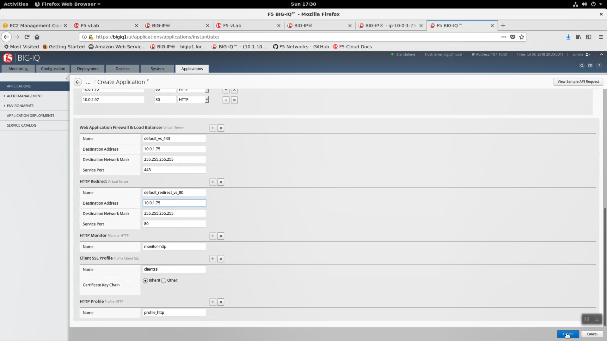

Create and deploy application services from Big-IQ 6.0
------------------------------------------------------

From your Super-NetOps terminal run "terraform output" and note the BigipExternalInterfacePrivateIP and both web-sever-x values.

.. code-block:: bash

   terraform output

.. image:: ./images/11_web_server_ips.png
  :scale: 50%

Applications tab => Applications => Create.

Select the "Default-f5-HTTPS-WAF-lb-template" from the Template drop-down. Click create.

+-------------------------------+--------------------------------------------------------+
| Parameter                     | value                                                  |
+===============================+========================================================+
| Name                          | app1                                                   |
+-------------------------------+--------------------------------------------------------+
| Domain Names                  | app1.f5lab.com                                         |
+-------------------------------+--------------------------------------------------------+
| Environment                   | Select BIG-IP                                          |
+-------------------------------+--------------------------------------------------------+
| BIG-IP                        | select your recently imported Big-IP from the dropdown.|
|                               | Collect HTTP Statistics.                               |
+-------------------------------+--------------------------------------------------------+
| Servers                       | web-server-1 and web-server-2; Port: 80; HTTP          |
+-------------------------------+--------------------------------------------------------+
| Web Application Firewall & LB:|                                                        |
| Destination Address           | IP address value of BigipExternalInterfacePrivateIP    |
+-------------------------------+--------------------------------------------------------+
| HTTP Redirect:                |                                                        |
| Destination Address           | IP address value of BigipExternalInterfacePrivateIP    |
+-------------------------------+--------------------------------------------------------+

Click create.

.. image:: ./images/12_create_application_part1.png
  :scale: 50%

Eventually, app1 status will report green and healthy. Note Security: Protection mode is Protected; Transparent.

.. image:: ./images/14_app1_created.png
  :scale: 50%