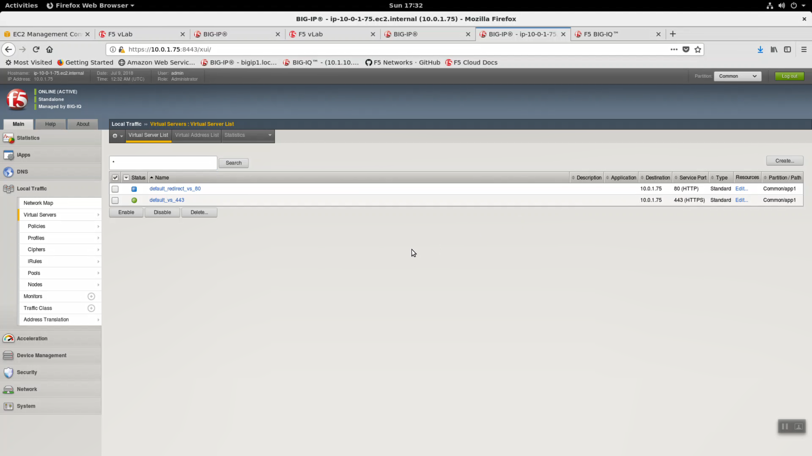
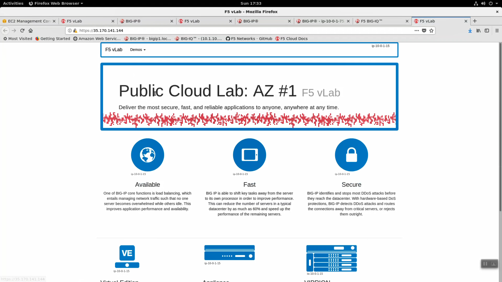
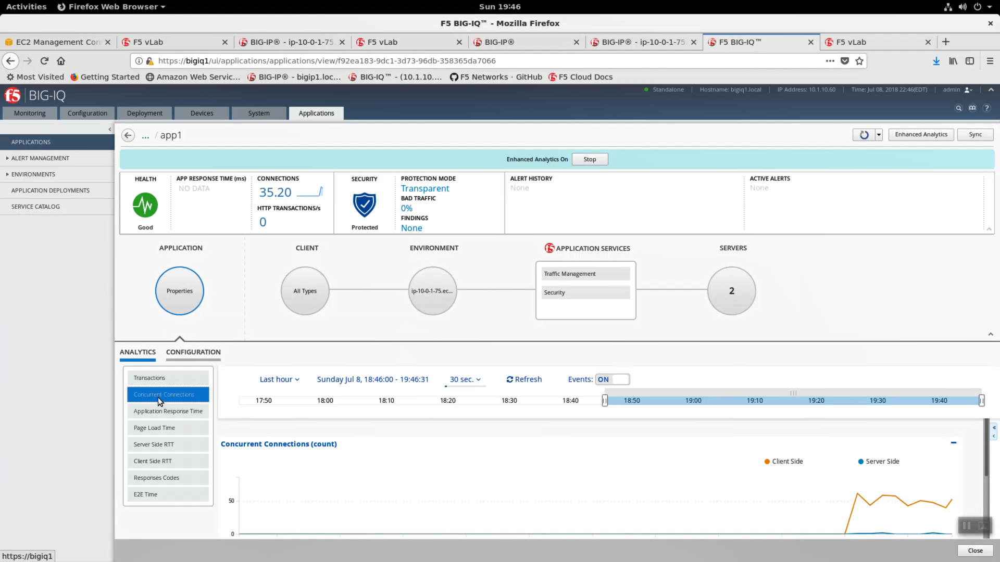

Explore application services deployed from Big-IQ 6.0
-----------------------------------------------------

Login to the https Configuration utility (Web UI) of the Big-IP VE hosted in AWS. Username: admin / Password: shortUrl value.

Local Traffic => Virtual Servers. Two virtual servers were deployed, one for http with an iRule attached that will redirect traffic to the https virtual server.

The virtual server has a WAF policy attached.

.. image:: ./images/17_explore_app1_part1.png
  :scale: 50%

.. image:: ./images/20_explore_app1_part4.png
  :scale: 50%

Security => Application Security => Policies. Review the WAF policy that was created and deployed.

.. image:: ./images/18_explore_app1_part2.png
  :scale: 50%

Click on "Learning and Blocking" settings to explore further. This is a starter policy and can be tuned, managed and monitored from Big-IQ by a dedicated security team supporting full Role Based Access Control.

.. image:: ./images/19_explore_app1_part3.png
  :scale: 50%

Open the sample application in a web browser. Refresh the page a few times by repeatedly hitting the [F5] key to generate a modest amount of traffic.

Back in Big-IQ you will soon see some connection info recorded. From the Big-IQ app1 view => Application Properties => Analytics => Concurrent Connections.

