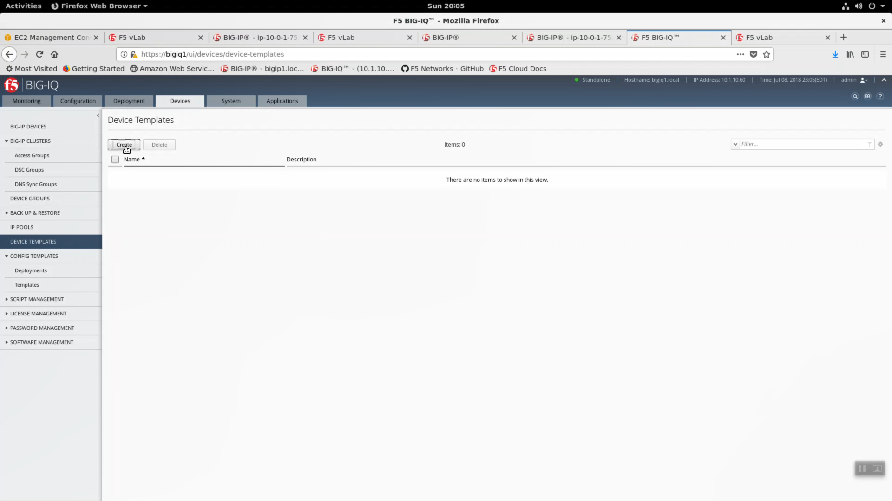
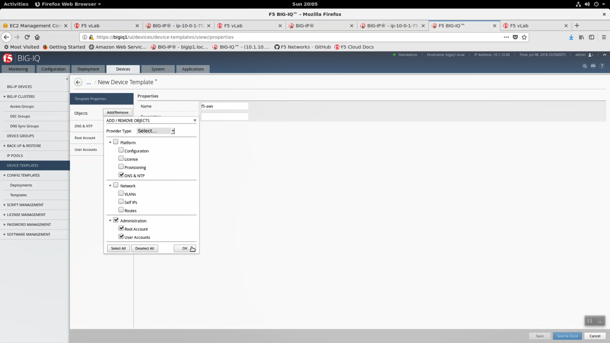
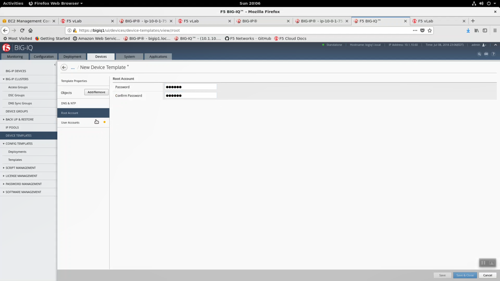
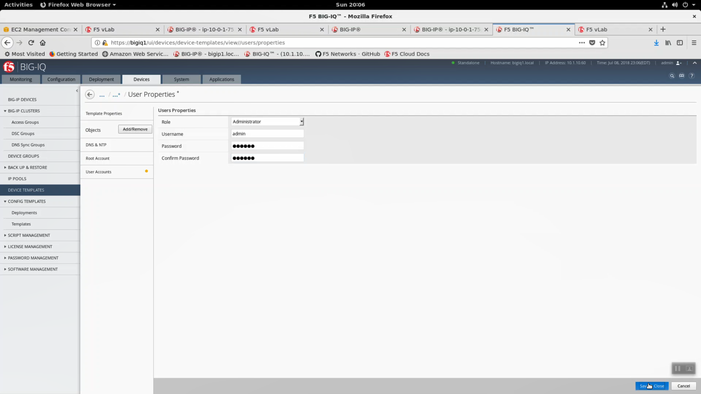
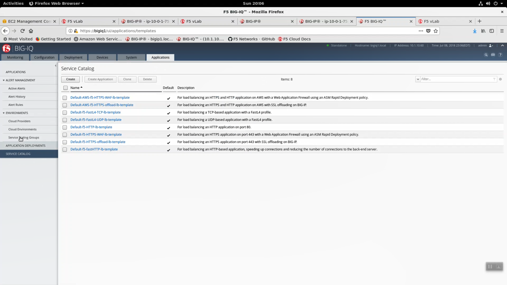

Create a Big-IQ Device Template
-------------------------------

From Big-IQ, create a device template. Devices tab => DEVICE TEMPLATES => Create.

New Device Template:
  - Name: f5-aws
  - check Platform: DNS & NTP
  - check Administration: Root Account
  - check Administration: User Accounts
  - Click OK

DNS & NTP
  - Lookup Servers: 1.1.1.1
  - NTP Server: pool.ntp.org
  - Timezone: America/New_York

Root Account
  - Password: <shortUrl value>

User Accounts
  - Role: Administrator
  - Username: admin
  - Password: <shortUrl value>

Click "Save & Close"

.. image:: ./images/3_create_device_template_3.png
  :scale: 50%

Now you can explore the Service Catalog. Look at the two AWS specific services at the top of the list. We will deploy "Default-AWS-f5-HTTPS-WAF-lb-template" in a future lab task.

