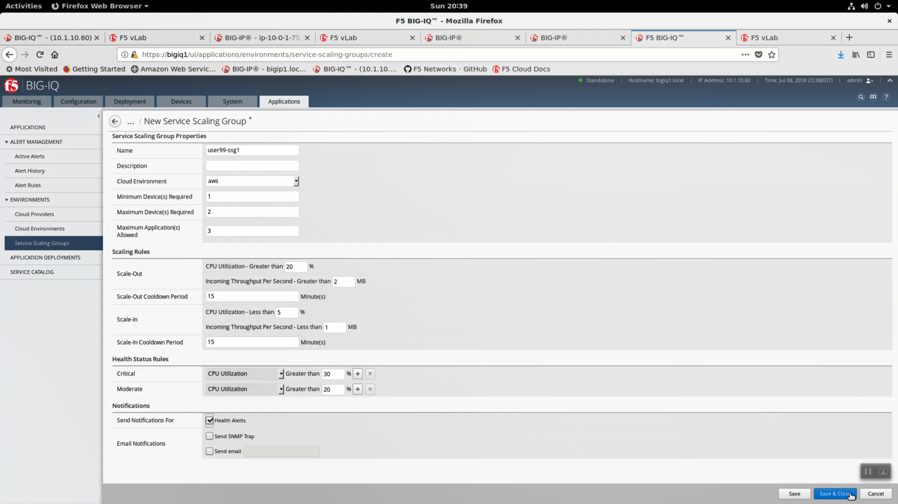

Create a Big-IQ Service Scaling Group
-------------------------------------

A Service Scaling Group will automatically:

- Deploy a per-app or shared platform Big-IP VE
- Deploy application services
- Configure an upstream AWS L4 load-balancer to scale out F5 Big-IP VE's in AWS based on throughput, high cpu, and other metrics.
- Collect comprehensive analytics

In Big-IQ, Applications => ENVIRONMENTS => Service Scaling Groups => Create New Service Scaling Group.

- Name: userXX-ssg1 where userXX is the user id uniquely assigned to you at the start of the lab.
- Cloud Environment: aws
- Minimum Device(s) Required: 1
- Maximum Device(s) Required: 2
- Maximum Application(s) Allowed: 3
 
Scaling Rules

- Scale-Out: CPU Utilization - Greater than 20%
- Incoming Throughput Per Second - Greater than 2MB
- Scale-In: CPU Utilization-Less than 5%
- Incoming Throughput Per Second - Less than 1MB

Heatlh Status Rules

- Critical : CPU Utilization : Greater than 30%
- Moderate: CPU Utilization: Greater than 20%

Notifications

- Send Notifications For: Health Alerts.

Click "Save & Close"

From the Big-IQ terminal, track logs carefully during deployment.

.. code-block:: bash

   tail -f /var/log/restjavad.0.log

.. image:: ./images/10_bigiq_tail_logs.png
  :scale: 50%

After a few minutes, the userXX-ssg1 service scaling group will be successfully deployed. Status will eventually be green and healthy. Click on userXX-ssg1.

Analytics => CPU Usage.

.. image:: ./images/13_explore_ssg_1.png
  :scale: 50%
