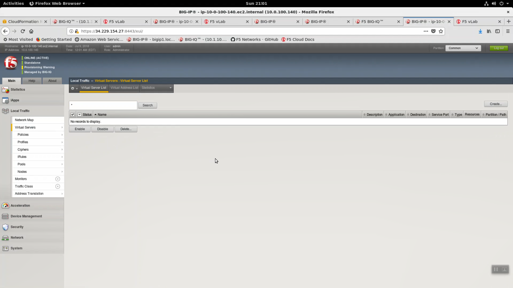
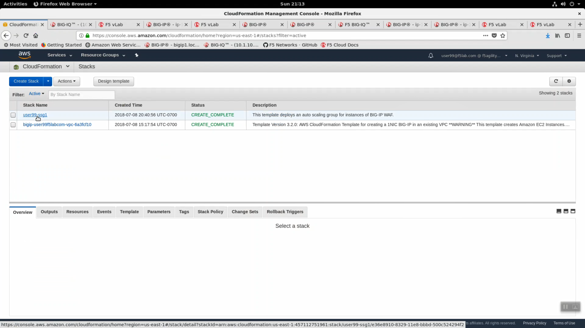
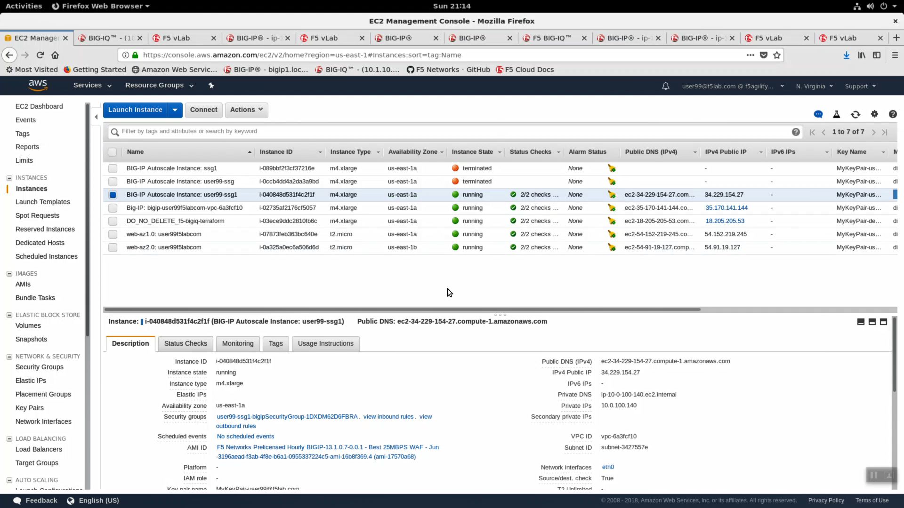

Explore the AWS environment created by the Big-IQ Service Scaling Group
-----------------------------------------------------------------------

Let's explore the new Big-IP VE that was deployed in AWS as part of the userXX-ssg1 service scaling group.

CONFIGURATION => Devices. Click on "Device Address" to launch the https config utility (Web UI) of our newly created Big-IP VE in AWS.

.. image:: ./images/14_ssg_device_login.png
  :scale: 50%

From the Big-IP Configuration Utility (Web UI) => System => Resource Provisioning. The Big-IP modules provisioned are:

- Local Traffic (LTM)
- Application Security (ASM)
- Application Visibility and Reporting (AVR)

.. image:: ./images/15_ssg_device_login.png
  :scale: 50%

Local Traffic => Virtual Servers. Because you haven't deployed an application yet, there is no Virtual Server configured.

iApps => bigiq-analytics. An analytics profile was deployed via an iApp. Big-IQ uses this analytics iApp to collect comprehensive analytics information for the applications we will deploy.

.. image:: ./images/17_ssg_device_analytics_iapp.png
  :scale: 50%

Login to the AWS console. Services => Management Tools => CloudFormation. Enter your username in the search filter (i.e. user99). You will see your userXX-ssg1 CloudFormation stack. Click userxx-ssg1 to explore details.

.. image:: ./images/19_ssg_cft_2.png
  :scale: 50%

From the AWS console, Services => Compute => EC2 => INSTANCES => Instances. Enter your username in the search filter (i.e. user99). You will see your BIG-IP Autoscale Instance: userXX-ssg1 Big-IP VE.

