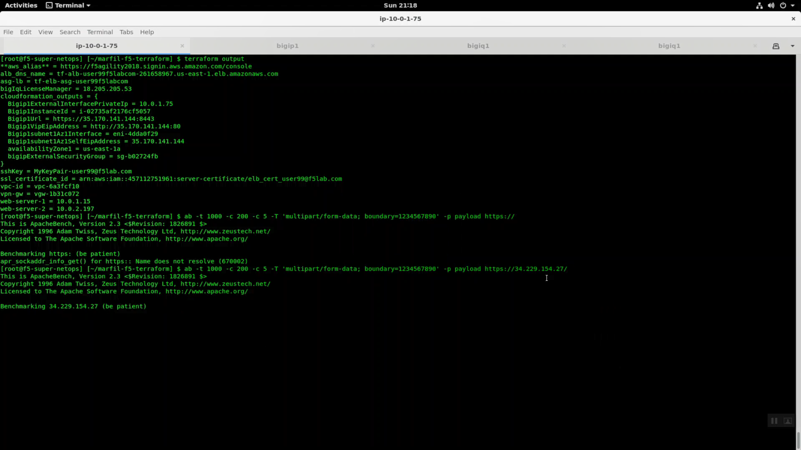
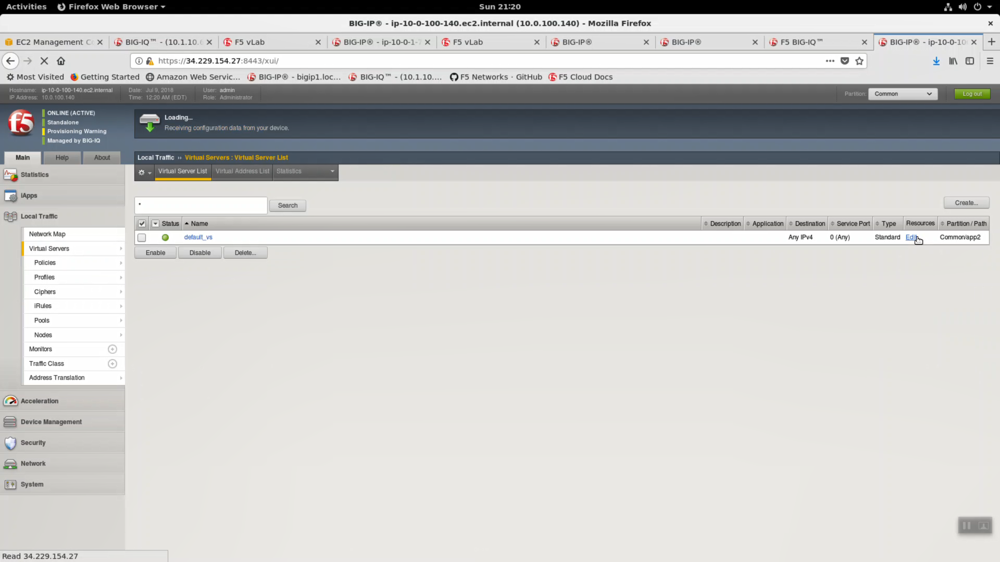
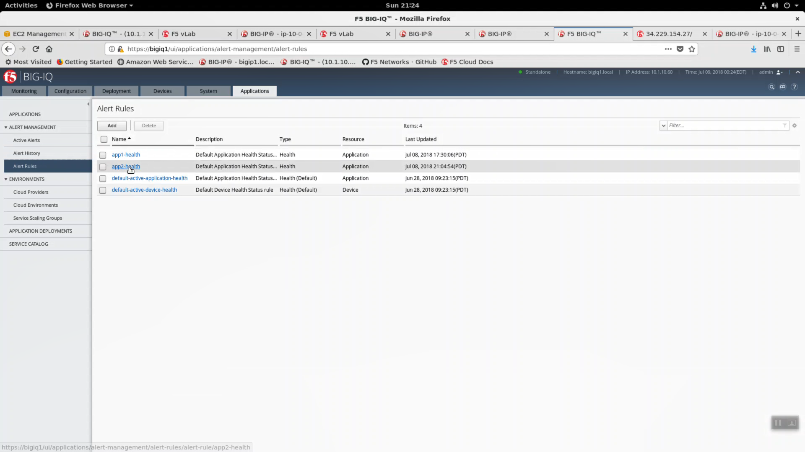
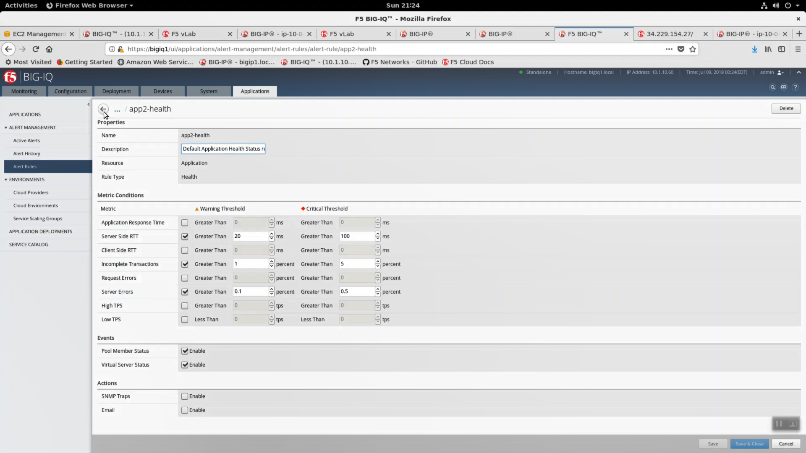
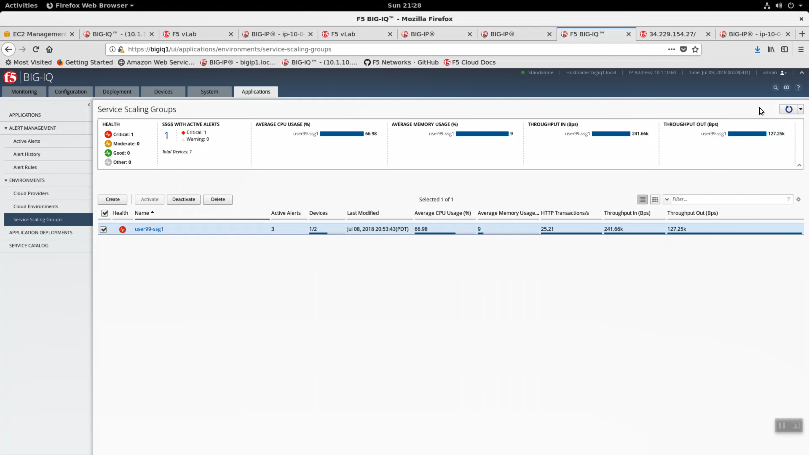
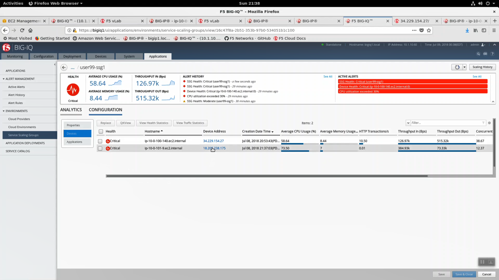
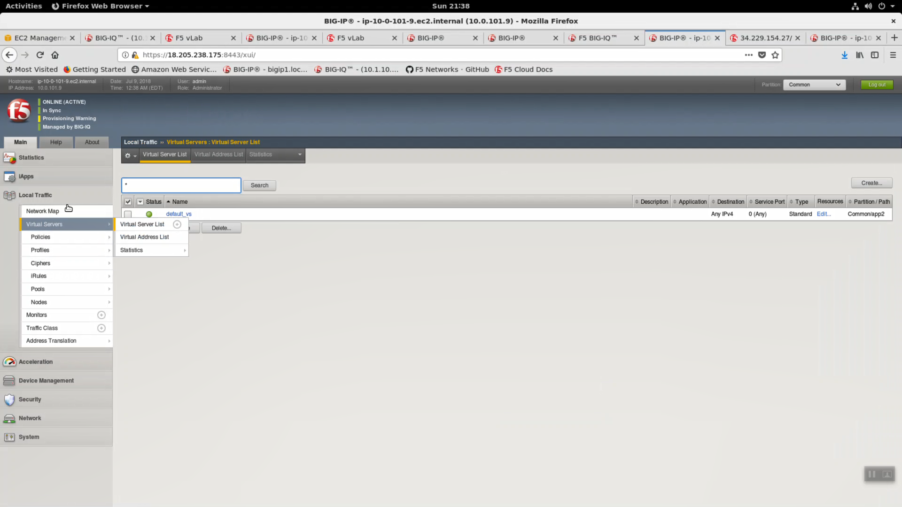

Test Autoscaling based on CPU usage
-----------------------------------

Autoscaling based on a combination of high cpu or throughput is a good way to scale out during periods of heavy use without over-investing in idle capacity.

From the Super-NetOps terminal, generate some traffic to the example app2 application. **Replace x.x.x.x with the public IP address of your app2 application.**

.. code-block:: bash

   base64 /dev/urandom | head -c 3000 > payload
   ab -t 300 -c 200 -c 5 -T 'multipart/form-data; boundary=1234567890' -p payload https://x.x.x.x/

.. image:: ./images/2_create_cpu_churn_irule.png
  :scale: 50%

Apply the cpu_churn iRule to simulate high cpu.

.. code-block:: bash

   when HTTP_REQUEST {
   set s [string repeat 0123456789 7000]
   set regex {(?:3[4|7]\d{2})(?:[,-]?(?:\d{5}(?:\d{1})?)){2}|(?:4\d{3})(?:[,-]?(?:\d{4})){3}|(?:5[1-5]\d{2})(?:[,-]?(?:\d{4})){3}|(?:6011)(?:[,-]?(?:\d{4})){3}}
   set idx [regexp -all -inline -indices $regex $s];
   HTTP::respond 200 content "Regex completed - wow, that was tiring.";
   }

.. image:: ./images/3_paste_cpu_churn_irule.png
  :scale: 50%

.. image:: ./images/5_attach_irule_2.png
  :scale: 50%

.. image:: ./images/7_https_app.png
  :scale: 50%

.. image:: ./images/8_cpu_usage.png
  :scale: 50%

.. image:: ./images/9_active_alerts.png
  :scale: 50%

.. image:: ./images/10_alert_history.png
  :scale: 50%

.. image:: ./images/13_health_critical_2.png
  :scale: 50%

.. image:: ./images/14_bigip_initializing.png
  :scale: 50%

.. image:: ./images/15_asg_details.png
  :scale: 50%

.. image:: ./images/16_asg_instances.png
  :scale: 50%

.. image:: ./images/17_ssg_max_instances.png
  :scale: 50%

