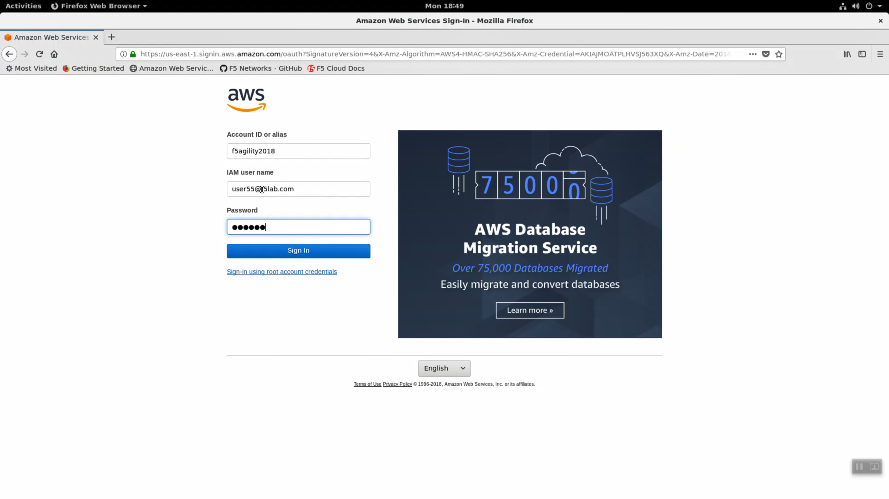
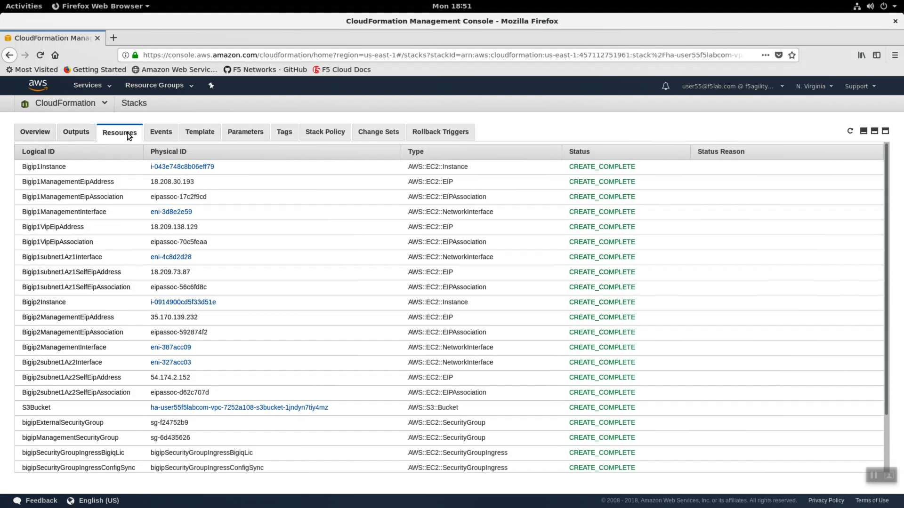
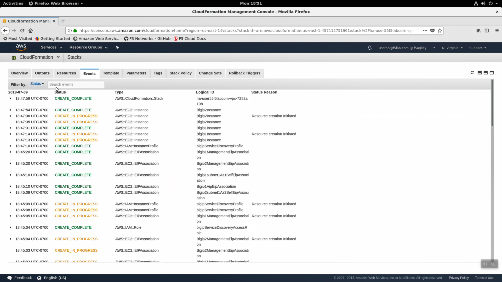
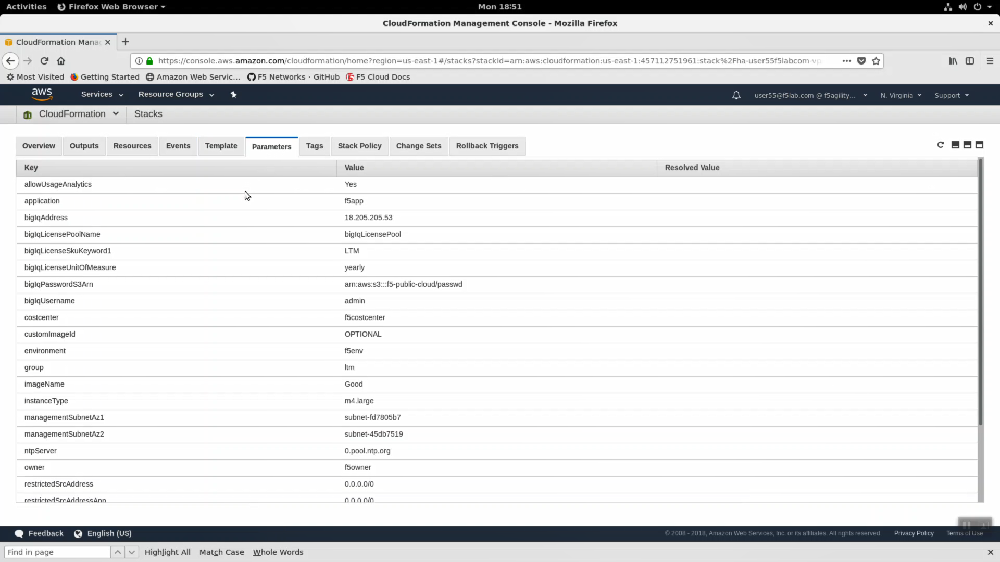
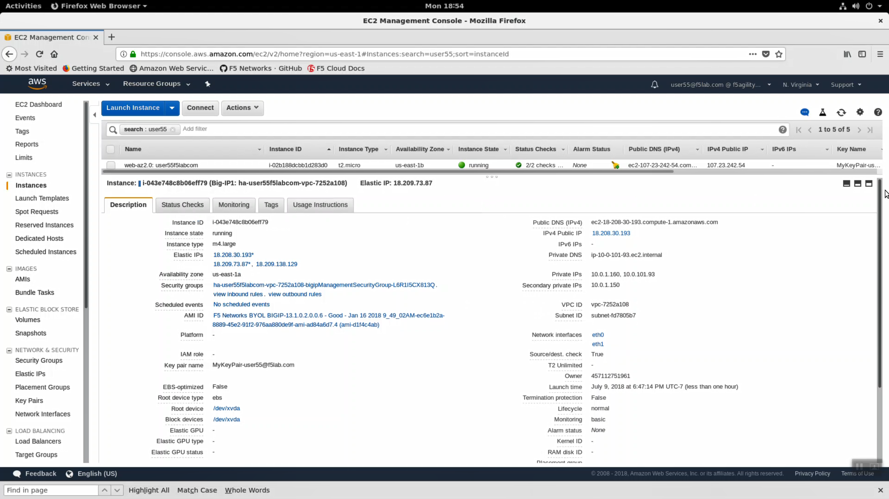
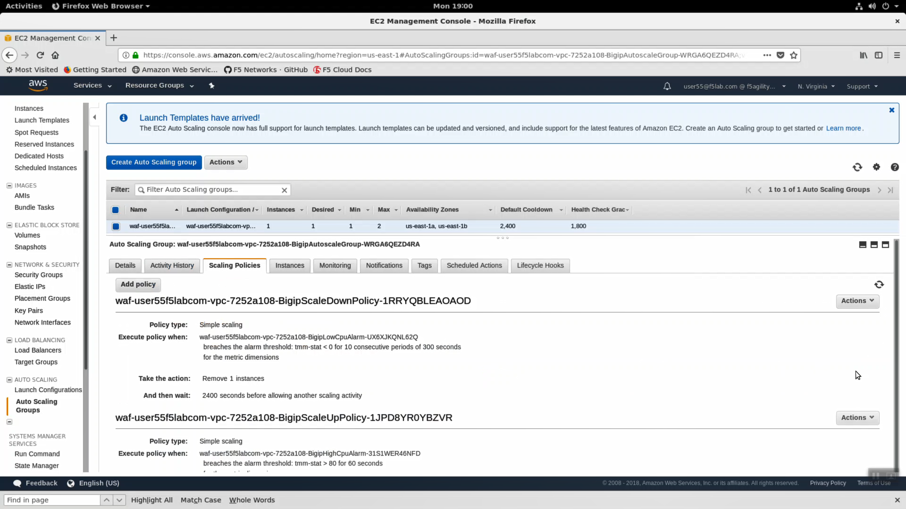
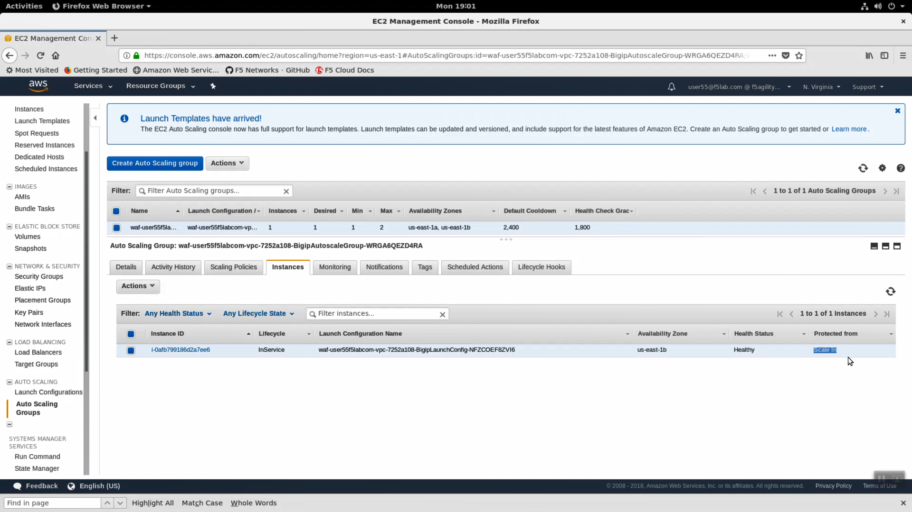

Explore the F5 / AWS lab environment
------------------------------------

Your instructor will share a view of the Big-IQ License Manager hosted on AWS. The class will see all of the instances dynamically licensed through Big-IQ.

When deploying to AWS you have flexible licensing options:

- Bring Your Own License (BYOL) - Can be transferred from one Virtual Edition environment to another (i.e. VMWare => AWS)
- Hourly - Launch an instance from the AWS self-service Marketplace portal and pay only for metered hourly use.
- Subscription - **This is the option used in this lab**. Every Big-IP launched will query the Big-IQ License Manager for a license. From Big-IQ we can revoke licenses as well.
- Enterprise License Agreement

.. attention::

   Below is a snapshot of the Big-IQ License Manager dynamically licensing devices in AWS. You're instructor can show this to the class during a lab session.

.. image:: ./images/0a_bigiq_licenses.png
  :scale: 50%

Launch the Firefox browser. Click on the bookmark for the Amazon AWS Console link in the upper-left-hand corner. Login with emailid as the username and shortUrl as password.

+--------------------------+------------------------------------------------------+
| Parameter                | value                                                |
+==========================+======================================================+
| Account:                 | f5agility2018                                        |
+--------------------------+------------------------------------------------------+
| User Name:               | userxx@f5lab.com, change xx to your student number   |
+--------------------------+------------------------------------------------------+
| Password:                | sames as shortUrl / echo $shortUrl                   |
+--------------------------+------------------------------------------------------+

.. attention::

   In the upper right-hand corner, ensure you are in the correct region. For example: N. Virginia region (us-east-1) is the default.

.. image:: ./images/2_region_check.png
  :scale: 50%

CloudFormation
--------------
Navigate to Services => Management Tools => CloudFormation. In the search field type your user account name (i.e user99). You should see your CloudFormation deployment details. You launched two CloudFormation templates.

.. image:: ./images/3_cloudformation_stacks.png
  :scale: 50%

- ha-userxxf5labcom-vpc-xxxxxxxx - Is the Cross-Availability-Zone deployment well documented in the F5 Github repository:
  https://github.com/F5Networks/f5-aws-cloudformation/tree/master/supported/failover/across-net/via-api/3nic/existing-stack/bigiq

.. image:: ./images/cft_cross-az-ha.png
  :scale: 50%

- waf-userXXf5labcom-vpc-xxxxxxxx - Is the Autoscale WAF deployment well documented in the F5 Github repository:
  https://github.com/F5Networks/f5-aws-cloudformation/tree/master/supported/autoscale/waf/via-lb/1nic/existing-stack/bigiq

.. image:: ./images/cft_autoscale_waf.png
  :scale: 50%

- Click the Events tab. The F5 CloudFormation template records every successful or failed event here. Look for the final “CREATE_COMPLETE” at the top. This indicates all went well.

.. image:: ./images/5_cft_events.png
  :scale: 50%

- Click on the Outputs tab. When CloudFormation deployments complete successfully, they can export key value pairs you can use to integrate other automation tools. For example, you can query these CloudFormation outputs to find out to which region, availability zone, private IPs, public IPs your F5 Big-IP Virtual Edition instance has been assigned.

.. image:: ./images/6_cft_outputs.png
  :scale: 50%

- Click on the Resources tab. Here we see a map (resource type to unique id) of all the AWS resources that were deployed from the CloudFormation template.

- Click the Events tab. The F5 CloudFormation template records every successful or failed event here. Look for the final “CREATE_COMPLETE” at the top. This indicates all went well.

- Click on the Parameters tab. We used terraform to stuff all of the necessary parameters into the CloudFormation template. Here you can see the CloudFormation parameter name and value provided.

EC2 
---
Navigate to Services => Compute => EC2 => INSTANCES => Instances. Enter your username in the search field (i.e. user99). The web application is hosted on webaz1.0 in one availability zone and webaz2.0 in another availability zone. Highlight web-az1.0.

.. image:: ./images/10_ec2_instances.png
  :scale: 50%

- In the "Description" tab below, note the availability zone. Highlight web-az2.0 and do the same.

- Take a look at the tags big-IP1-ha... has been assigned. In public cloud deployments you can use tags (key-value pairs) to group your devices.

.. image:: ./images/12_ec2_instance_tags.png
  :scale: 50%

- Cloud-init. Version 13 of Big-IP supports cloud-init. Right click on BIGIP1 => Instance Settings => View/Change User Data. Cloud-init is the industry standard way to inject commands into an F5 cloud image to automate all aspects of the on-boarding process: https://cloud-init.io/.

.. image:: ./images/13_cloud_init.png
  :scale: 50%

Navigate to Services => Compute => EC2 => # Key Pairs. Type your username in the search field (i.e. user99). You will see the ssh key that was created for you and upload to AWS. By default, F5 Big-IP VE appliances deployed to AWS do not have any default root or admin account access. You have to enable or create these accounts. Initially, you can only connect via ssh using your private key. From the Super-NetOps terminal, see if you can find the private key in your home directory.

.. image:: ./images/14_keypair.png
  :scale: 50%

Navigate to Services => Compute => EC2 => LOAD BALANCING => Load Balancers. In the search filter enter your username. You should see two load balancers. One named tf-elb-* is your newly created AWS load balancer.

.. image:: ./images/15_elb_description.png
  :scale: 50%

- Highlight the ‘Description’ tab. Note:

  - Scheme: internet-facing
  - Type: Classic

.. image:: ./images/16_elb_instances.png
  :scale: 50%

- Click the "Health Check" tab => [Edit health Check]. The classic load-balancer is limited to basic health checks.

.. image:: ./images/17_elb_health_checks_limited.png
  :scale: 50%

- Click the "Listeners" tab => [Edit]. The classic load-balancer is limited to HTTP, HTTPS, TCP and SSL (no UDP).

.. image:: ./images/18_elb_listeners_limited.png
  :scale: 50%

Navigate to Services => Compute => EC2 => AUTO SCALING => Auto Scaling Group. Highlight the "Activity History" tab. You can the autoscale WAF CloudFormation template created an auto scaling group. Read the Description and Cause.

.. image:: ./images/19_asg_activity.png
  :scale: 50%

- Click the "Scaling Policies" tab. Read through the polices to understand how the autoscale WAF deployment is programmed to both scale out during a surge and scale in when the surge subsides.

- Click the "Instances" tab. The single instance running the F5 WAF. Notice the instance is "Protected from: Scale in". This means that AWS will guarantee a minimum of one F5 WAF instance is running at all times. If someone where to accidentally stop or terminate an instance, this policy would automatically trigger the creation of a new one.

VPC
---
Navigate to Services => Networking & Content Deliver => VPC. click on VPCs. Enter your username in the search filter (i.e. user99). This is the Virtual Private Cloud (VPC) that has been dedicated to your lab environment.
Select the Summary tab. You can see the IPv4 CIDR assigned is 10.0.0.0/16. Your on-premises datacenter has been assigned 10.1.0.0/16 to not conflict.

.. image:: ./images/22_vpc.png
  :scale: 50%

Github
------
- Fully supported F5 Networks Solutions are hosted in the official F5 Networks GitHub repository: https://github.com/f5networks
- We are running the lab from the F5 Super-NetOps container: https://github.com/f5devcentral/f5-super-netops-container
- AWS CloudFormation templates: https://github.com/F5Networks/f5-aws-cloudformation
- Native template formats are also available for Microsoft Azure (arm templates): https://github.com/F5Networks/f5-azure-arm-templates
- Native template formats are also available for Google Cloud Platform (gdm templates): https://github.com/F5Networks/f5-google-gdm-templates

.. image:: ./images/f5-github.png
  :scale: 50%