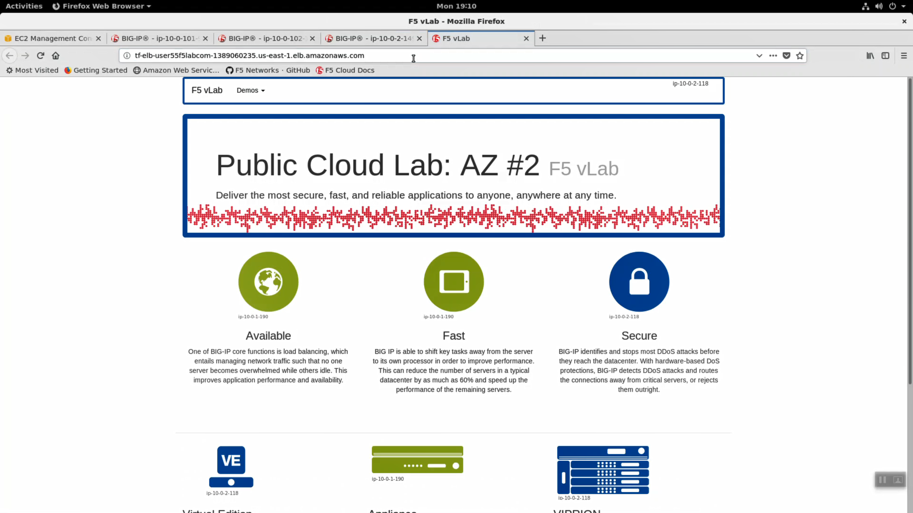
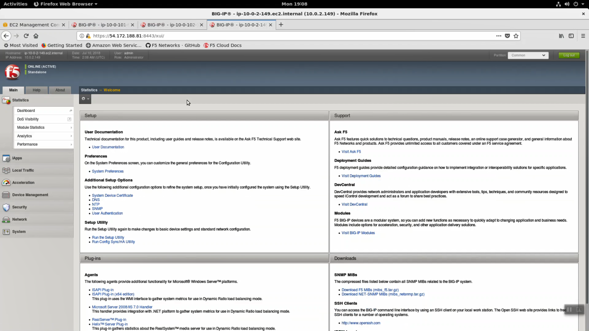
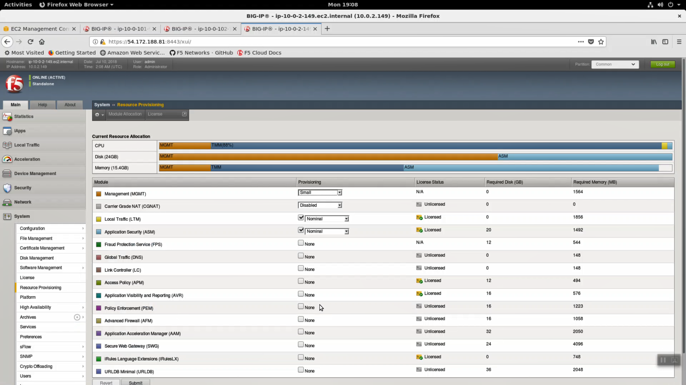
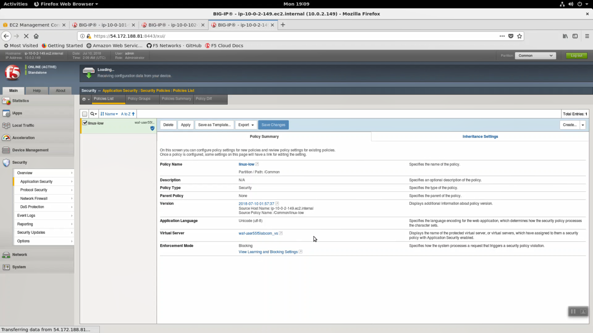
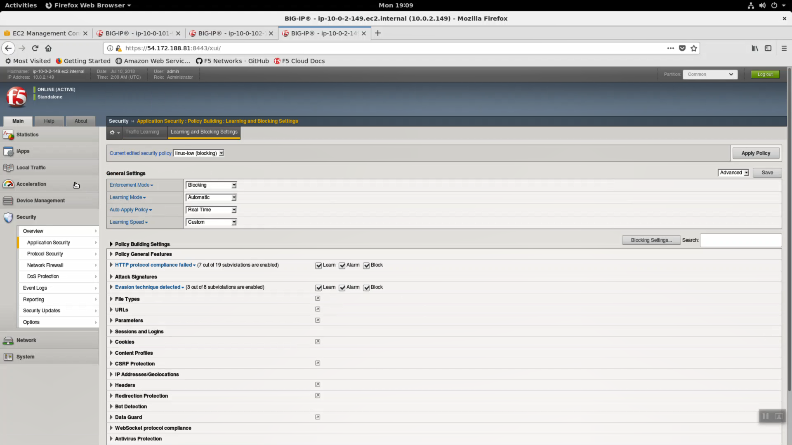
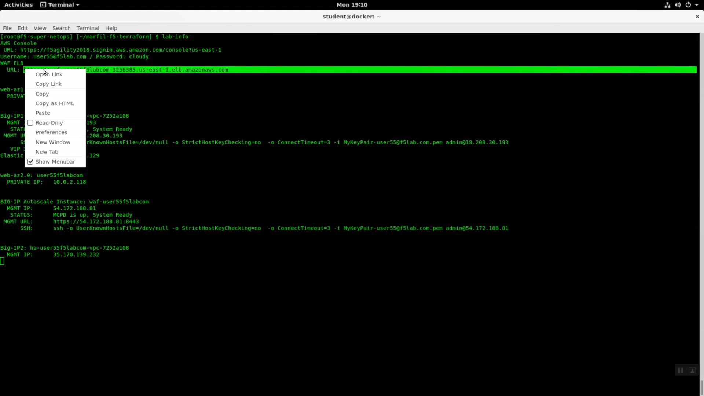

Explore the F5 Big-IP Virtual Editions Deployed
-----------------------------------------------

From the Super-NetOps terminal, run the handy lab-info utility. Confirm that "MCPD is up, System Ready" for all three of your instances.

.. code-block:: bash

   lab-info

.. image:: ./images/1_mcp_up.png
  :scale: 50%

.. attention ::
   
   Do not attempt to reset the Big-IP password until **MCPD is up, System Ready**.

Initially, you can only login to an F5 Big-IP VE in AWS via SSH using an SSH key. You will have to enable admin and root password access. Invoke the reset-password utility with the IP address of each of your Big-IP VE's as the argument. **REPLACE THE x.x.x.x PLACEHOLDER WITH THE MANAGEMENT IP ADDRESSES OF YOUR THREE F5 BIG-IP VE'S. This will enable the admin account on all three of your Big-IP's and change the password to the value of the shortUrl.**

.. code-block:: bash
   
   reset-password x.x.x.x
   reset-password y.y.y.y
   reset-password z.z.z.z

  
Run ``terraform output`` and note the value of elb_dns_name.

.. code-block:: bash

   terraform output

Open a new tab in the Firefox browser. HTTP to elb_dns_name. Confirm the sample application is up.

  
Open a new tab in the Firefox browser. HTTPS to the MGMT URL of BIG-IP Autoscale Instance. Don't miss management port is :8443!

.. code-block:: bash
   
   lab-info

.. attention ::

   This lab makes use of insecure self-signed certificates. Bypass the warnings by clicking on “Confirm Security Exception”.

.. image:: ./images/2_cert_warning.png
  :scale: 50%

Login with Username: admin Password: value of shortUrl.

.. image:: ./images/3_https_login.png
  :scale: 50%

Main => System => Resource Provision. Note an F5 WAF is provisioned for both LTM and ASM.

Main => Security => Application Security => Policies List. A starter "linux-low" policy has been deployed.

Click on "Learning and Blocking" settings to see exactly what a "linux-low" policy consists of. This starter policy is often times imported in to Big-IQ for central management.

Local Traffic => Virtual Server => Properties. A virtual server with a "catch-all" listener of 0.0.0.0/0 has been deployed.

.. image:: ./images/8_waf_virtual_server.png
  :scale: 50%

The "linux-low" security policy is attached to this virtual server.

.. image:: ./images/9_waf_policy_enabled.png
  :scale: 50%

From the Super-NetOps terminal run "lab-info" and copy the value for WAF ELB -> URL. Open a new browser tab and HTTPS to the WAF ELB URL. Your sample application is protected behind an F5 WAF.

.. image:: ./images/12_https_waf.png
  :scale: 50%

Login to either Big-IP1 or Big-IP2. Main => iApps => Application Services. The Cross-AZ HA Big-IP has been deployed with the F5 AWS HA iApp.

.. image:: ./images/13_ha_iapp.png
  :scale: 50%
