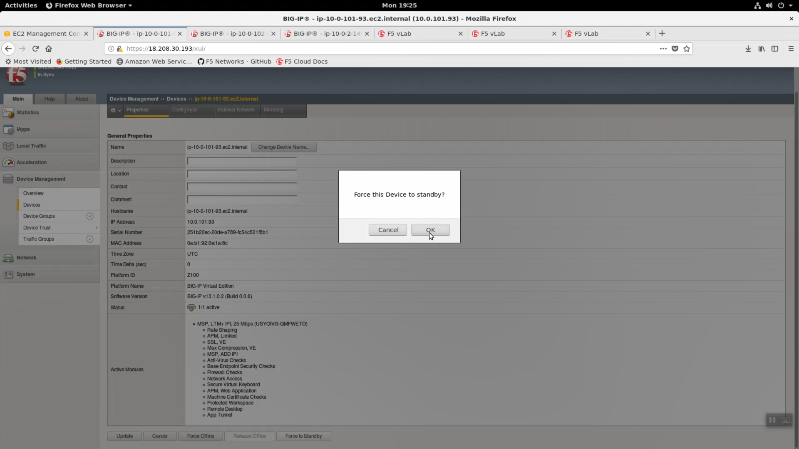
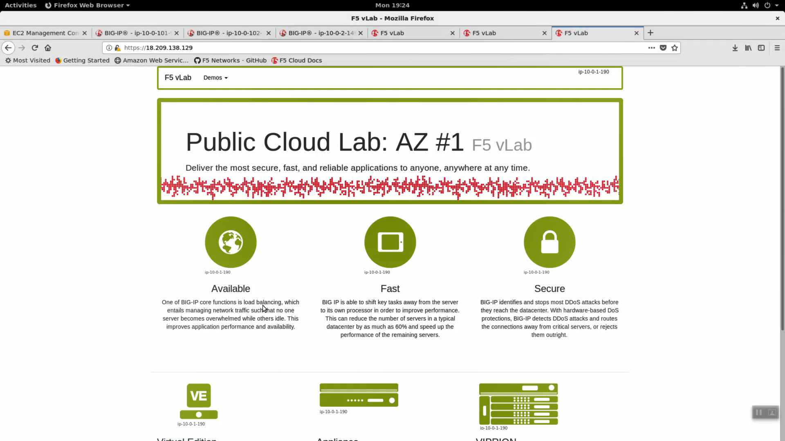
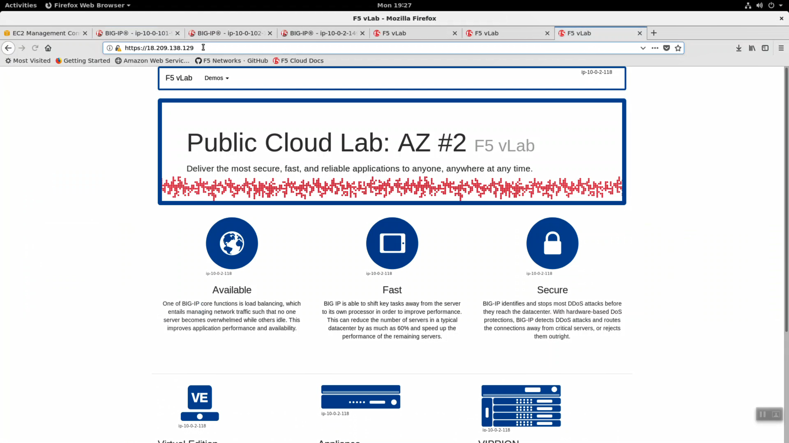

Test Failover
-------------

From the Super-NetOps terminal, run the handy lab-info utility. Confirm that "MCPD is up, System Ready" for all three of your instances.

.. code-block:: bash

   lab-info

From the HTTPS Configuration Utility (Web UI) of the active Big-IPX device: Device Management => Devices. [Force Offline]. Click [OK] to confirm.

.. image:: ./images/1_force_standby.png
  :scale: 50%

From the Super-NetOps terminal, run the lab-info utility. Notice how the Elastic IP previously associated with Big-IP1 has now "floated over" and is associated with Big-IP2.

.. code-block:: bash

   lab-info

.. image:: ./images/3_terraform_failover_eip.png
  :scale: 50%

HTTPS to the Elastic IP. We simulated a failover event and our sample application is still up. Because only the Big-IP has failed, not the whole Availability Zone, and the client is configured for persistence, the application is still served up from the same Availability Zone.

Now we'll simulate an Availability Zone outage. From the https Configuration Utility (Web UI) of the active Big-IPX device: Local Traffic => Pools => Members => Select the pool member in Availability Zone #1 (almost always the first pool member) and [Force Offline].

.. image:: ./images/5_disable_node1.png
  :scale: 50%

HTTPS to the Elastic IP. Hit refresh [F5] a few times to refresh the cache. Notice we are not connecting to the application on AZ#2.

.. note::
   Traditional HA failover relies on Layer 2 connectivity and a heartbeat to trigger a fail-over event and move a ‘floating IP’ to a new active unit. There is no Layer 2 connectivity in the cloud across availability zones. The Big-IP will detect an availability zone outage or trouble with a Big-IP VE and the elastic IP will ‘float’ over to the new active device as you just saw.