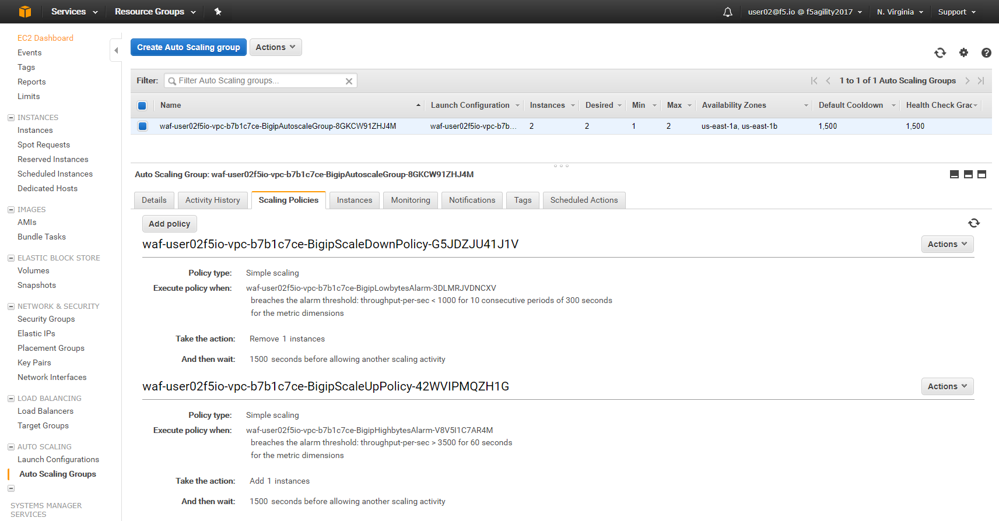
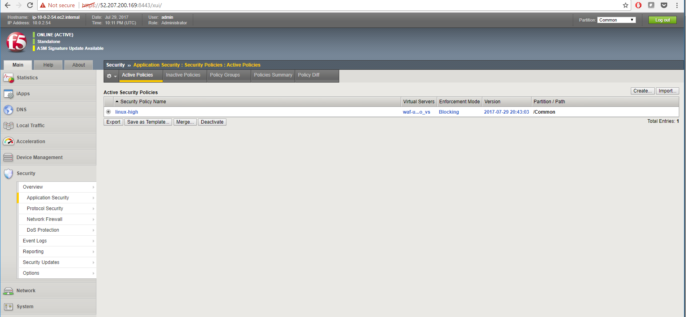
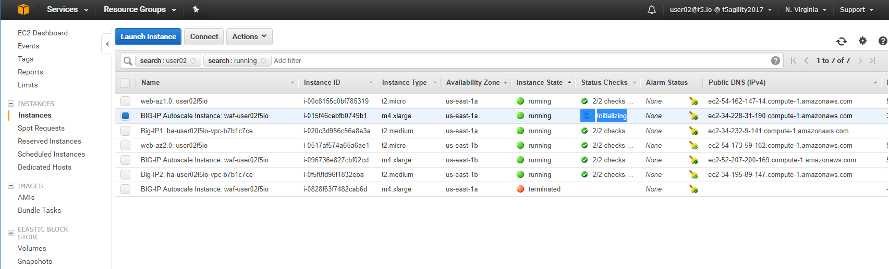

Autoscale WAF
-------------

HTTPS to the WAF ELB URL. 

.. image:: ./images/waf-example-site.png
  :scale: 50%

From the AWS console, navigate to Services => AUTO SCALING => Auto Scaling Groups. Filter on your username and select your waf-userxx... auto scaling group.

Select the 'Instances' tab below, and select your Instance ID (there should be only one). If your instance is "Protected from... Scale in" then it will always stay up regardless of scale up/down thresholds configured. It's common to keep a single minimum WAF instance running at all times and scale the 2nd, 3rd, Nth WAF during surges.

.. image:: ./images/autoscale-pending.png
  :scale: 50%

Select the Scaling Polices tab. These policies were deployed via the CloudFormation template and can be changed via the CloudFormation template.

Login to the active BIG-IP Autoscale Instance MGMT IP **on port 8443** configuration utility (web ui).

.. code-block:: bash

   lab-info

In the Big-IP Configuration utility (Web UI) navigate to Security -> Application Security -> Security Policies -> Active Polices. A "linux-low" policy was deployed via CloudFormation template and is in Enforcement Mode: Blocking.

From the f5-super-netops container, let's launch some traffic against the application behind our WAF and watch it autoscale to service the surge! Replace the https://waf-userxx... in the command below with the one in the output of lab-info and don't miss that critical forward slash / at the end!

.. code-block:: bash

   base64 /dev/urandom | head -c 3000 > payload
   ab -t 120 -c 200 -c 5 -T 'multipart/form-data; boundary=1234567890' -p payload https://waf-user11f5democom-xxxxxxxxx.us-east-1.elb.amazonaws.com/

Services => Compute => EC2 => INSTANCES => Instances. Filter on your username and after 60 seconds (the lowest configurable time threshold) hit refresh to see your 2nd autoscale WAF instance starting.

