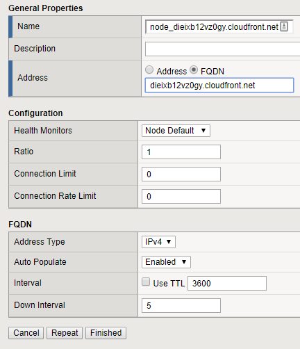
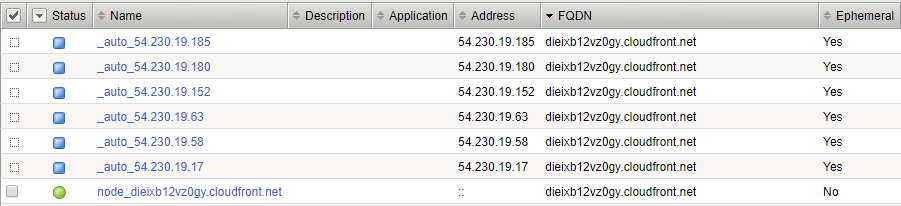
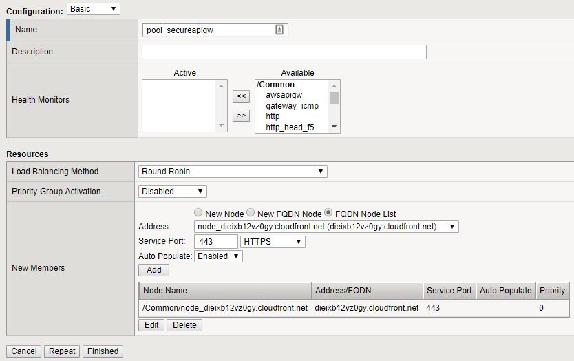

Basic Configuration
-------------------

Create Nodes
~~~~~~~~~~~~

There is a limitation when creating pool members using FQDN. If your
CLoudFront url start with a number, TMOS does not accept the
auto-generated object name. To avoid this issue, create a node with a
specific a name.

1. To get your Target Domain Name, open the \"Target Domain Names.txt\" file located at the Windows desktop.

2. “Go to Local Traffic > Nodes > Nodes List” and click “Create”

3. Name: node\_YOUR\-TARGET\-DOMAIN\_NAME (e.g.:
   node\_dieixb12vz0gy.cloudfront.net)

   We got this information on step 1.

4. Auto Populate: Enable

5. Select FQDN in Address and fill with your YOUR-TARGET-DOMAIN_NAME

6. Click Finished
   
   |image10|

7. Nodes related to this FQDN (ephemeral) will be automatically
   generated.
   
   |image11|

Create Pool
~~~~~~~~~~~

1. Go to “Local Traffic > Pool > Pool List” and click “Create”

2. Name: pool\_secureapigw

3. For this lab we will not apply a monitor to this pool.

4. Select “FQDN Node List”

5. Address: Select the node you created in the previous task.

6. Service Port: 443 (API GW does not support unencrypted traffic)

7. Click Add

8. Click Finished

   |image12|

