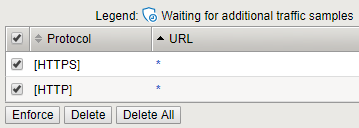

Create an Application Security Policy
-------------------------------------

1.  Go to “Security > Application Security > Security Policies”

2.  Click Create

3.  Select Advanced View

4.  Policy Name: asmpolicy\_careX

5.  Virtual Server: Select the virtual server you created in the
    previous tasks

6.  Application Language: Unicode UTF-8 (Need to do this before Learning
    Mode)

7.  Learning Mode: Manual

8.  Server Technologies: Select Node.js

9.  Signature Staging: Disabled (only for lab purposes, staging is
    recommended for production)

10. Click Create Policy

    |image35|

11. The API GW uses other HTTP Methods that are not included by default
    in the ASM Policy. Let’s add them. Go to “Security > Application
    Security > Headers > Methods” and click Create.

12. Select OPTIONS, then Create.
   
    |image36|

13. Repeat the process to add DELETE:
   
    |image37|

14. At this time we’ll not map all the parameters and URLs our web app
    has. So, we will just enforce the “\*” parameter so our signatures
    can work.
    
    Go to “Security > Application Security > Parameters > Parameters
    List”

15. Mark the checkbox of the “\*” parameter and click Enforce, then Ok.

16. Go to “Security > Application Security > URLs > Allowed URLs”

17. Select both, HTTP and HTTPS “\*”

    |image38|
   
18. Click Enforce

19. By default, ASM shows an HTML blocking page when blocking a request.
    Since we are in front of the API Gateway, we need to proper respond
    the client with a JSON message. Go to “Security > Application
    Security > Policy > Response Pages”

20. Change the Response Type to “Custom Response”

21. Paste the content of BlockResponseBody.txt you have in your Desktop
    (Windows Jump Host)

    .. code-block:: json

      {
          "status": "error",
          "data": {
          "message": "The requested URL was rejected. Please consult with your
       administrator. Your support ID is: <%TS.request.ID()%>"
          }
       }

    |image39|

22. Click Save.

23. Click Apply Policy, then Ok.

.. |image35| image:: image35.png
.. |image36| image:: image36.png
.. |image37| image:: image37.png

.. |image39| image:: image39.png
