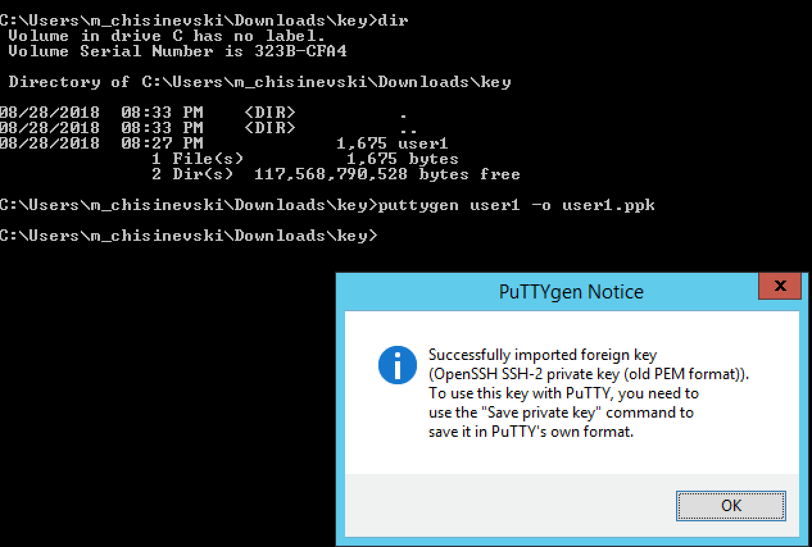
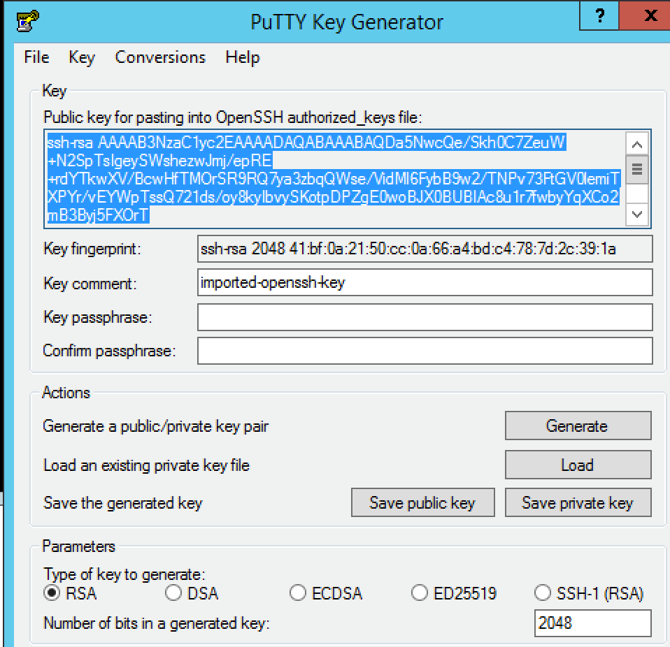
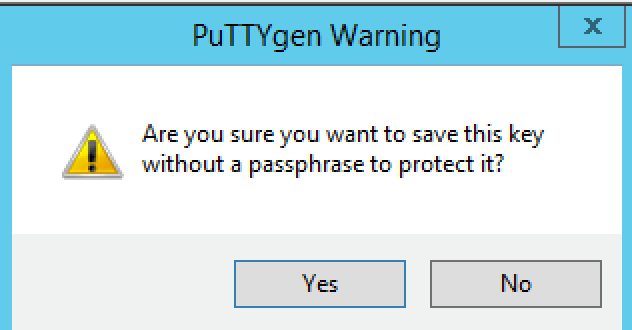

To Do
-----

 - Nick will share Google slides explaining key GCP concepts including VPC networks, VPC network peering, GCLB, forwarding rules, Hybrid connectivity options (VPN, Interconnect, Cloud routers).

 - Add instruction for Windows users

 - Add documentation in ReadTheDocs Agility format: https://github.com/marcf5/googlelabdays/, “develop” branch

 - Share the registration link with customers and partners: https://bit.ly/2whfXsz

 - Generate F5-BIG-VE-BT-1G-V13-LIC licenses for the student (5 licenses for each student)

Ansible
-------

Use Ansible to keep the F5 BIG-IPs in sync (instead of F5 configsync).

  Example - try updating the following with two IPs:
 
https://github.com/F5Networks/f5-ansible/blob/devel/examples/0000-getting-started/inventory/hosts
 
 Running the playbook:
 
https://github.com/F5Networks/f5-ansible/blob/devel/examples/0000-getting-started/playbook.yaml
 
...should update both hosts simultaneously.

Demos
-----
Live demos (F5 advanced web application firewall, autodiscovery of GCP and GKE apps, F5 remote access incl. SSL VPN, F5 IPSec to Google VPN Gateway etc) at https://bit.ly/2I4cBw5
All students have read-only access to all the F5 BIG-IPs used for the live demos.

SSH Keys (Windows)
------------------

Instructions for Windows users

Download putty from https://www.chiark.greenend.org.uk/~sgtatham/putty/latest.html

Convert the key “userX” to PPK format as follows

  
Click “OK”   
  
Click “Save private key” (you do NOT need to copy the public key at the top of screenshot below)  
  

Click “Yes”  

  
Save the key as userX.ppk (replace X with the number provided to you by the proctor)

  
You are now ready to configure putty.

Paste the IP address provided by the proctor

.. image:: ./images/image24.png
  :scale: 50%
  
Go to Connection/Data and set “Auto-login username” to userX, where X is the number provided to you by the proctor.  
  
.. image:: ./images/image25.png
  :scale: 50% 
  
Go to Connection/SSH/Auth and click on “Browse”
  
.. image:: ./images/image26.png
  :scale: 50%   

Select the private key (PPK format)
  
.. image:: ./images/image26.png
  :scale: 50% 
  
Click “Open”

.. image:: ./images/image27.png
  :scale: 50% 
  
Click “Open”

.. image:: ./images/image27.png
  :scale: 50% 

  