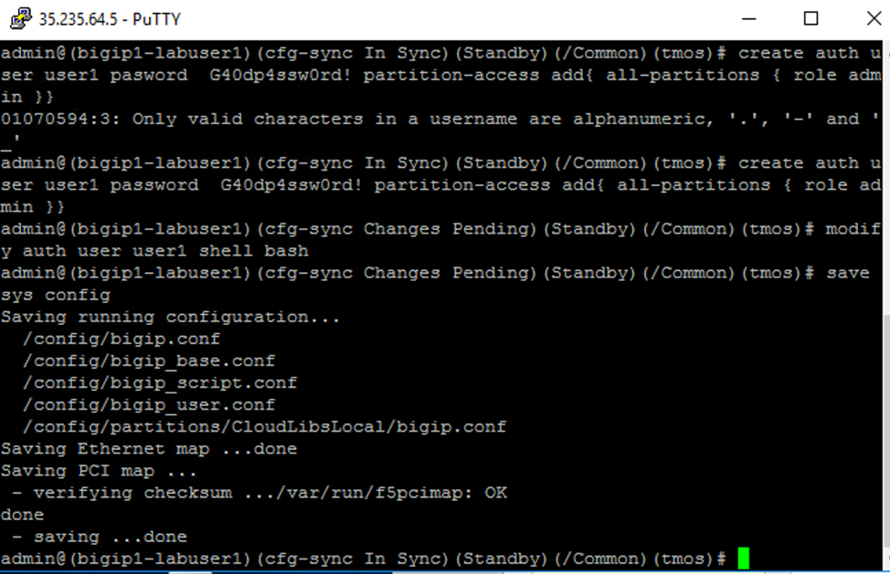
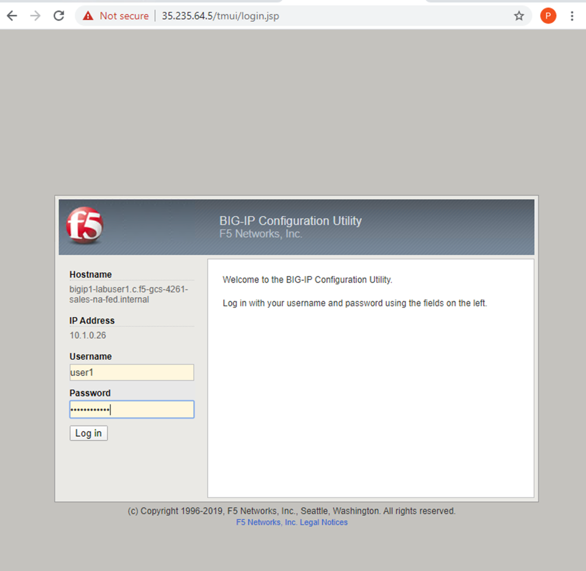
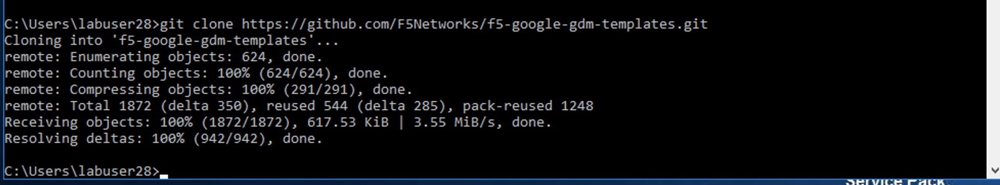
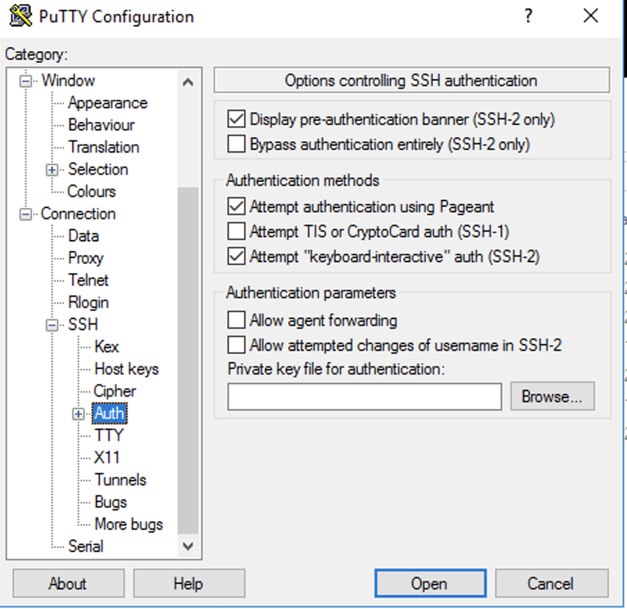

Exersize 1: Deploying the GDM Template
======================================

Objective:
----------

-  Deploy an API based failiver pair of BIG-IPs in google cloud.

-  Familiarize yourself with the YAML configuration file that is used to deploy the template in google cloude.

Lab Requirements:
-----------------

-  All Lab requirements will be noted in the tasks that follow

-  Estimated completion time: 30 minutes

Excercise 1: Deploying The GDM template
-----------------

Task – Review the template YAML file
~~~~~~~~~~~~~~~~~~~~~~~~~~~~~~~

#. Open Visual Studio Code. 

#. Open your particular YAML file to review.

The file will be at 

- c:\\Users\\labuserX\\f5-google-gdm-templates\\supported\\failover\\same-net\\via-api\\3nic\\existing-stack\\byol

Task Deploying the BigIP VE templates.
~~~~~~~~~~~~~~~~~~~~~~~~~~~~~~~~~~~~~~~~

#. Open a windows command line.

Navigate to 

c:\\Users\\labuserx

Use the git command to clone the google cloud templates.

Type the following..

git clone https://github.com/F5Networks/f5-google-gdm-templates.git

|image013|

#. Change directory to.. 

C:\\Users\\labuserx\\f5-google-gdm-templates\\supported\\failover\\same-net\\via-api\\3nic\\existing-stack\\payg>

or  (meaning your particular home directory for your student number. Should be c:\\Users\\labuserx

~/f5-google-gdm-templates/supported/failover/same-net/via-api/3nic/existing-stack/payg

#. Open VS Code

Open the file 

C:\Users\\labuserxx\\f5-google-gdm-templates\\supported\\failover\\same-net\\via-api\\3nic\\existing-stack\\payg\\f5-existing-stack-same-net-cluster-payg-3nic-bigip.yaml

|image014|

**Save the file as **f5-existing-stack-same-net-cluster-payg-3nic-bigip.sample.yaml**

#. Edit the Following Values in the YAML file

  properties:

   - region: **'us-west2'**

   - availabilityZone1: **'us-west2-a'**

   - mgmtNetwork: **'management-vpc'**

   - mgmtSubnet: **'management-vpc-subnet'**

   - restrictedSrcAddress: **'0.0.0.0/0'**

   - network1: **'external-vpc'**

   - subnet1: **'external-vpc-subnet'**

   - aliasIp: **'This Value is assigned on a per student basis'**

   - numberOfForwardingRules: **1**

   - network2: **'internal-vpc'**

   - subnet2: **'internal-vpc-subnet'**

   - provisionPublicIP: **'yes'**

   - imageName: **'f5-bigip-15-0-1-0-0-11-payg-best-1gbps-190803012348'**

   - serviceAccount: **agility221@f5-gcs-4261-sales-agility2020.iam.gserviceaccount.com**

**After you have made changes to the YAML file. Save it in VSCode File/Save.**

**Note the file C:\\Users\\Public\\Documents\\studentsubs for student specific \29 subnet assignments for aliasIP**

#. Run the command…

gcloud deployment-manager deployments create <name of deployment> --config <name of yaml file> --description <description>

For example...

gcloud deployment-manager deployments create labuserx --config f5-existing-stack-same-net-cluster-payg-3nic-bigip.sample.yaml --description labuserx

**If the deployment fails you should delete, fix the yaml file and re-create the deployment**

Example deployment deletion.

Where X is the number of the labuser type the command.

**gcloud deployment-manager deployments delete labuserX**

NOTE:After you run the template create it will take **at least 15 minutes** for the BigIPs to come up… before you can SSH to the boxes.

Note once the template is done.. you will see something like…

|image001|

You will now need IP addresses in order to SSH to the particular instances that you have created.

In the jumpbox type.

gcloud compute instances list --filter="name:( <yourdeploymentname> )"

Note the template will create “ephemeral” ip addresses. These can be made static in a real world deployment through the google template.

Note the IP addresses.

** In the output the first IP is External, the secodnd Mgmt,  and the third Internal. **
**The ephemeral  IP's for the management interface are the last IP addresses in the list.**

|image020|

You will use these IP addresses in order to connect to your resources in google…

Task – Configure BIG-IP Pair
~~~~~~~~~~~~~~~~~~~~~~~~~~~~~~~

1. Login into the first bigip and create a user. 

    As the boxes are in a sync failover group the changes with be synced across both units so you can make changes on one box and they will be synched to the other box.

    ssh to the admin server of each bigIP 

    ssh admin@<yourbigIPaddress>
    
    **Note you will need a key to login ot the admin server**
    **The key is called "labusers" amd it is located in C:\\Users\\Public\\Documents**
    **Putty is installed on the jumphost**
    **You will need to set the private key in putty under 'SSH\Auth'

    |image021|

2. You are going to create a user that you can use to login on both Big-IP units.

-	Disables password-based ssh for the default accounts (this means the BIG-IP web GUI can’t be accessed either) – add steps for creating non-key account: 

create auth user user1 password G40dp4ssw0rd! partition-access add { all-partitions { role admin } }

modify auth user user1 shell bash

save sys config

 |image002|

You will now be able to use this username and password in order to login to TMUI.

Task – Testing
~~~~~~~~~~~~~~~~~~~~~~~~~~~~~~~

To determine the IP addresses to access TMUI you can type

gcloud compute instances list --filter="name:( <yourdeploymentname> )"

TMUI can be reached by typing 

https://<IPOFTMUI>

You can user the user1 that we created in order to login to the Big-IPSs

 |image003|

 Exersize 1 is now COMPLETED

.. |image001| image:: media/image001.png
   :width: 6.14in
   :height: 2.31in

.. |image014| image:: media/image014.png
   :width: 14.1in
   :height: 10.35in
.. |image020| image:: media/image20.png
   :width: 8.79in
   :height: 0.81in

