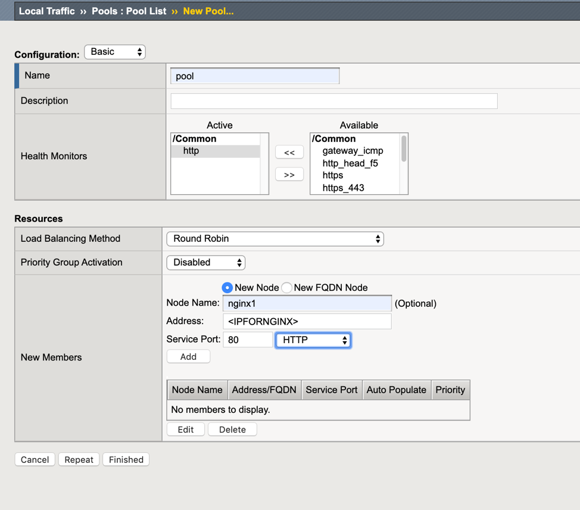
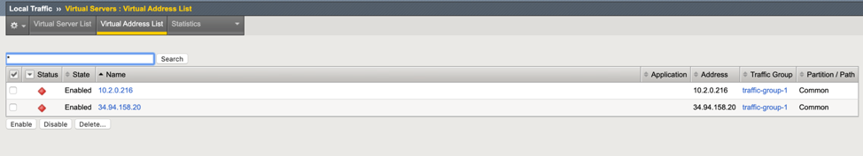
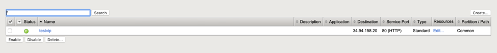

Lab 2: Create VIP and Test Failover
====================================================

The purpose of this lab is to test failover after deploying your API based failover google cloud template.

Objective:
----------

-  Gain an understanding of how API base failover functions for BIG-IP in google cloud.

Lab Requirements:
-----------------

-  Completed Lab1 "Deploying GDM Template"

-  Estimated completion time: 25 minutes

Excercise 2: Create VIP and Test
-----------------

Task – Create a Test VIP
~~~~~~~~~~~~~~~~~~~~~~~~~~~~~~~

#.	Create Pool 

Navigate to local traffic/traffic/pools list.
Click the “Create” button on the top right.

 
|image004|

Note: You an get the IP for the Apache back end server by typing 

‘gcloud compute instances list’

You will use the “internal IP address”

PoolName: ‘pool’
Health Monitor:’http’
Node Name:’nginx1’
Address: <Apache Server IP”
Click “add” to add the pool member
Click “Finished”

|image005|

Your end state should look like the following.

#.	Create VIP

The VIP should use the forwarding IP that was created.

Note the forwarding IP..

Click on local traffic/Virtual Servers/Virtual Address List

Note the IP address.

 |image007|

Click Local Traffic/Virtual Servers/Virtual Server List

Select Create..

- Name: ‘testvip’
- Destination Address/Mask: <IPNOTEDINVIRTUALADRESS>
- Service Port: 80:
- SNAT: Automap
- Default Pool: ‘pool’

 
|image008|

|image009|
 

Your end state should similar to the below.

|image010|

Task – Test Failover
~~~~~~~~~~~~~~~~~~~~~~~~~~~~~~~

#. Open a browser and navigate to http://yourvip 

Note the VIP uses the forwarding IP that was created by the template.

#. Perform a failover while tailing the failover log.

To test.

**On each BIG-IP**

- ssh to box as user
- in TMSH type **run util bash** to get to a bash command line
- **tail -f /var/log/cloud/google/failover.log**
- In TMUI go to devices/device management/ and select “force to standby on the active unit”d) 
   
- Watch logs.

You should note the following in the failover.log on box that is being failed to…

|image011|

The lab is now Completed.
-------------------------

.. |image004| image:: media/image004.png
   :width: 6.49in
   :height: 1.31in

.. |image006| image:: media/image006.png
   :width: 6.49in
   :height: 0.63in

.. |image008| image:: media/image008.png
   :width: 6.49in
   :height: 1.53in
.. |image009| image:: media/image009.png
   :width: 6.49in
   :height: 0.5in

.. |image011| image:: media/image11.png
   :width: 6.53in
   :height: 2.81in
