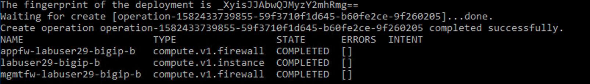
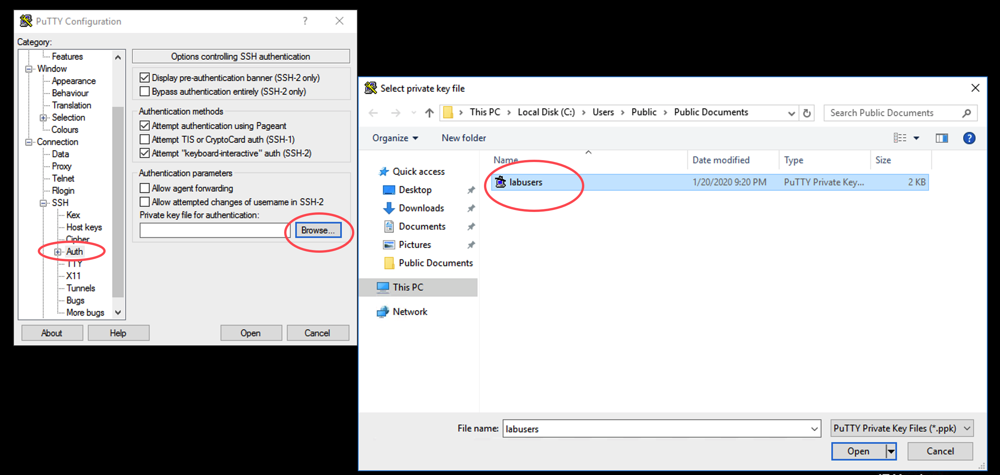
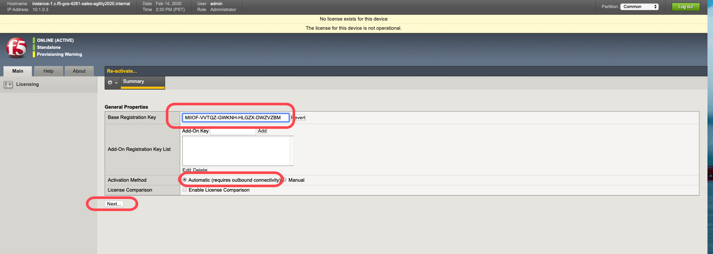
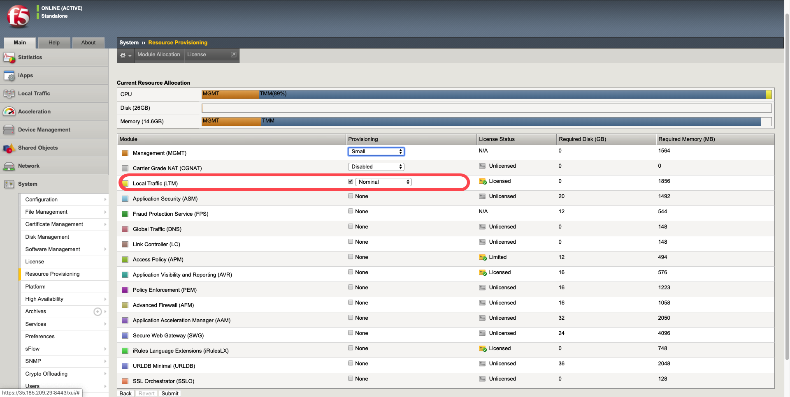
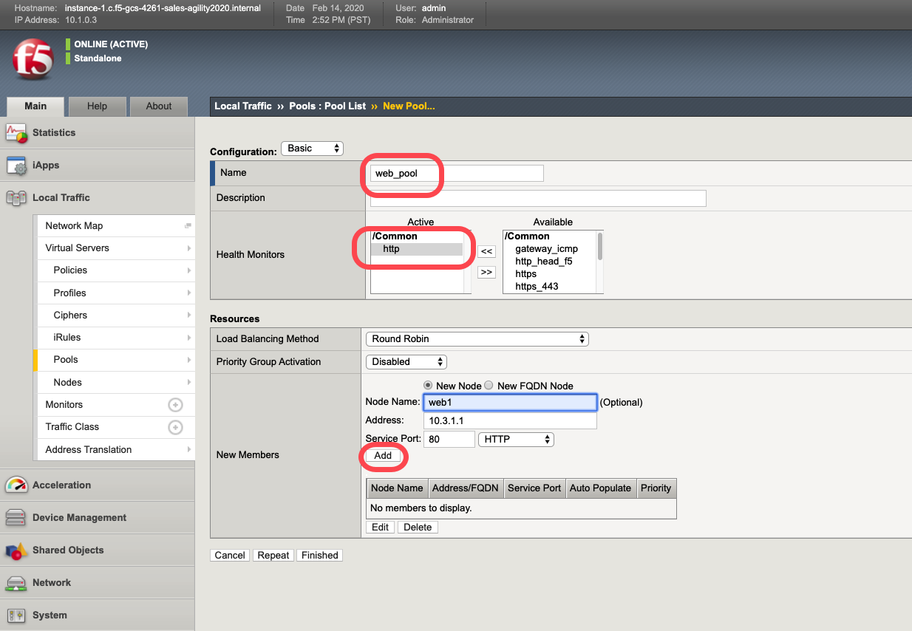
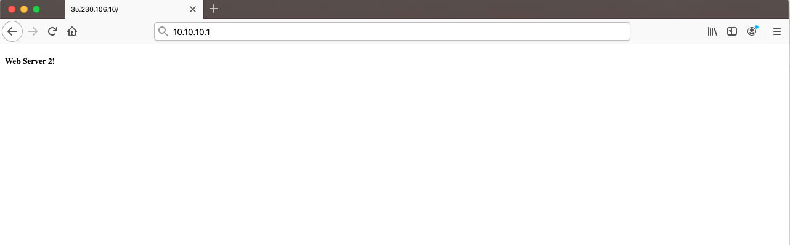
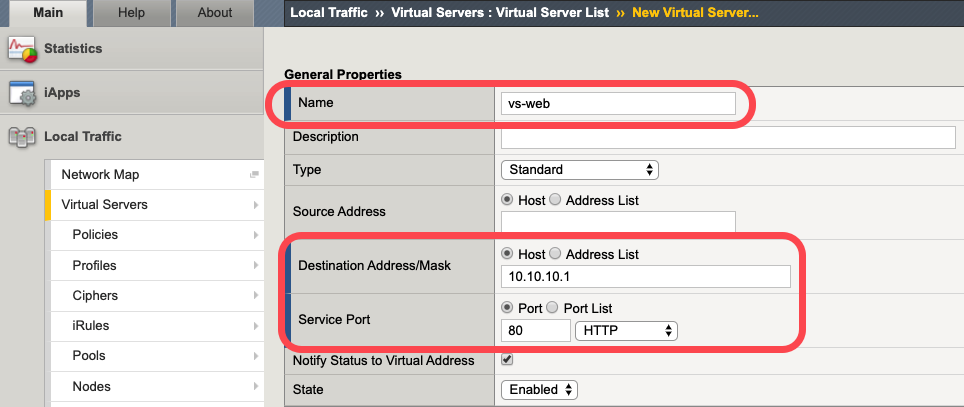

Task 2: Deploy BIGIP-B using Google Deployment Manager (GDM) templates
======================================================================

In this lab we will deploy **BIGIP-B** using Google Deployment Manager
template. Below is the summary steps you will be taking to deploy BIG-IP
in GCP. When completed, you should be able to send traffic to your
application servers through BIG-IP VE.

All F5 supported GDM templates can be found at
https://github.com/F5Networks/f5-google-gdm-templates. In this lab, we
will be using **1nic BYOL** template.

Summary steps
-------------

1. Download and prepare the GDM template
2. Setup initial configuration on BIGIP-B
3. Create a pool and a virtual server

Step1 - Download and prepare the GDM template
---------------------------------------------

1.1 RDP to window jumphost at **35.197.78.160** using provided credentials.

1.2 All the templates are pre-cloned to the window jumphost. We will use **1nic standalone byol** template for this lab. The 1nic template file can be found at **c:\\users\\labuserX\\f5-google-gdm-templates\\supported\\standalone\\1nic\\existing-stack\\byol**

1.3 Open Visual Studio Code program from the desktop, to view/edit the
YAML file. **File->Open folder** to **C:\\Users\\labuserX\\f5-google-gdm-templates\\supported\\standalone\\1nic\\existing-stack\\byol**

1.4 You should see 3 files: python, schema and yaml files. YAML file contains the parameters necessary to deploy the BIG-IP instance in Google Cloud, and calls the python script to launch the instance. Open **f5-existing-stack-byol-1nic-bigip.yaml** file to review. All the editing work will be done in this YAML file.

1.5 Edit the parameters in the YAML file as described below. Don't forget to **Save** the file.

+---------------------------+----------------------------------------------------------+
| Parameters                | Value                                                    |
+===========================+==========================================================+
| region                    | us-west2                                                 |
+---------------------------+----------------------------------------------------------+
| availabilityZone1         | us-west2-a                                               |
+---------------------------+----------------------------------------------------------+
| mgmtNetwork               | external-vpc-121                                         |
+---------------------------+----------------------------------------------------------+
| mgmtSubnet                | external-vpc-121-subnet                                  |
+---------------------------+----------------------------------------------------------+
| mgmtSubnetAddress         | 10.1.2.x                                                 |
+---------------------------+----------------------------------------------------------+
| restrictedSrcAddress      | 0.0.0.0/0                                                |
+---------------------------+----------------------------------------------------------+
| restrictedSrcAddressApp   | 0.0.0.0/0                                                |
+---------------------------+----------------------------------------------------------+
| provisionPublicIP         | yes                                                      |
+---------------------------+----------------------------------------------------------+
| imageName                 | f5-bigip-15-0-1-0-0-11-byol-ltm-1boot-loc-190803010901   |
+---------------------------+----------------------------------------------------------+
| instanceType              | n1-standard-4                                            |
+---------------------------+----------------------------------------------------------+
| mgmtGuiPort               | 8443                                                     |
+---------------------------+----------------------------------------------------------+
| applicationPort           | 80                                                       |
+---------------------------+----------------------------------------------------------+
| licenseKey1               | Use provided eval key here                               |
+---------------------------+----------------------------------------------------------+
| ntpServer                 | time.google.com                                          |
+---------------------------+----------------------------------------------------------+
| timezone                  | UTC                                                      |
+---------------------------+----------------------------------------------------------+
| bigIpModules              | ltm:nominal                                              |
+---------------------------+----------------------------------------------------------+
| allowUsageAnalytics       | yes                                                      |
+---------------------------+----------------------------------------------------------+
| logLevel                  | info                                                     |
+---------------------------+----------------------------------------------------------+
| declarationUrl            | default                                                  |
+---------------------------+----------------------------------------------------------+

.. figure:: ./images/task2/yaml.png
   :alt: yaml configuration file

1.6 No action needed on this step. Google cloud SDK(gcloud) is already pre-installed and initialized on the window jumphost. You can review how-to documents below later.

::

    https://cloud.google.com/sdk/install

    https://cloud.google.com/sdk/docs/initializing

1.7 Open the command prompt from the Desktop. Change the directory to where the 1nic template files are.

``cd c:\users\labuserX\f5-google-gdm-templates\supported\standalone\1nic\existing-stack\byol``

1.8 Now we are ready to deploy the template file with gcloud. Run the command.

This is the gcloud syntax:

``gcloud deployment-manager deployments create <name of deployment> --config <name of yaml file> --description <description>``

+----------------------+------------------------------------------+
| Parameters           | Value                                    |
+======================+==========================================+
| name of deployment   | labuserX-bigip-b                         |
+----------------------+------------------------------------------+
| name of yaml file    | f5-existing-stack-byol-1nic-bigip.yaml   |
+----------------------+------------------------------------------+
| description          | labuserX-deployment                      |
+----------------------+------------------------------------------+

Once the deployment is successfully completed. you will see something like below. it will take **at least 10 minutes** for the BIG-IP to boot up before you can SSH into it.

NOTE: If the deployment fails you should delete, fix the yaml file and re-create the deployment.

``gcloud deployment-manager deployments delete labuserX-deployment``

1.9 After you run the template create it will take at least 10 minutes for the BigIP to come up before you can SSH into it.

Step2 - Setup initial configuration of BIG-IP
---------------------------------------------

2.1 From the window jumphost, use **PuTTY** to connect to the BIGIP-B instance at **10.1.2.X**. Point to the private key for authentication. The private key file is at \*\*Public Documents\*

2.2 Login with default username **admin**. To ensure you are at the tmsh command prompt, type **tmsh**.

``modify auth password admin``

2.3 Type the new password **LabuserX@gcp121** and press Enter. The terminal screen displays the message:

``changing password for admin`` ``new password:``

2.4 Type the new password and press Enter. The terminal screen displays the message:

``confirm password``

2.5 Change the hostname to **labuserX-bigip-b.agility20.com** . For example **labuser29-bigip-b.agility20.com**

``modify sys global-settings hostname labuser29-bigip-b.agility20.com``

2.7 Ensure that the system retains the changes:

``save sys config``

2.8 Open a web browser and log in to the BIGIP-B configuration utility by using port 8443. For example: **https://10.1.2.x:8443**. The username is admin and the password is the one you set previously.

2.9 Click **Activate** and license the BIGIP-B with one of the evaluation keys provided to you.

2.10 Choose **Resource Provisioning** screen. Default is fine. Click **Submit**.

Step3 - Create a pool and a virtual server
------------------------------------------

3.1 In BIG-IP Configuration utility, for example: **https://10.2.1.X:8443**.

3.2 Create a pool with two members. On the Main tab, click **Local Traffic -> Pools**. Click **Create** per below.

+-------------------+----------------------+
| Field             | Value                |
+===================+======================+
| Name              | web\_pool            |
+-------------------+----------------------+
| Health Monitors   | http                 |
+-------------------+----------------------+
| Node Name         | web1, web2           |
+-------------------+----------------------+
| Address           | 10.3.1.1, 10.3.2.1   |
+-------------------+----------------------+
| Service Port      | 80                   |
+-------------------+----------------------+

3.3 In the **Name** field, type **web\_pool**. Names must begin with a letter, be fewer than 63 characters, and can contain only letters, numbers, and the underscore (\_) character.

3.4 Verify all pool members are healthy **Local Traffic -> Pools:Pool List ->web\_pool -> Members**.

.. figure:: ./images/task1/pool2.png
   :alt: pool2

3.5 Now we will create a virtual server that listens for packets destined for BIGIP's IP address. In BIG-IP configuration utility, **Local Traffic -> Virtual Servers**. Click **Create**.

+------------------------------+---------------+
| Field                        | Value         |
+==============================+===============+
| Name                         | vs\_web       |
+------------------------------+---------------+
| Destination Address/Mask     | 10.2.1.X/16   |
+------------------------------+---------------+
| Service Port                 | 80            |
+------------------------------+---------------+
| HTTP Profile                 | http          |
+------------------------------+---------------+
| Source Address Translation   | Auto Map      |
+------------------------------+---------------+
| Default Pool                 | web\_pool     |
+------------------------------+---------------+

3.6 You can test the application now. Open a browser **http://10.1.1.x**. You should see a webpage with **Web Server 1!** or
**Web Server 2!**.

Task 2 is completed here :)
---------------------------

.. |vs2| image:: ./images/task1/vs2.png
.. |vs3| image:: ./images/task1/vs3.png
